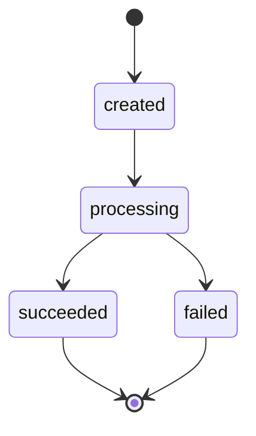

# Ledgerline

A payments backend, built in phases.

**Phase 0: Foundation** — repo, Docker, Alembic, CI scaffolding. Done.
**Phase 1: The money model** — a double-entry ledger. Done.
**Phase 2: Payment lifecycle** — a state machine, a fake processor, an atomic
charge flow. Done.
**Phase 3: Idempotency** — a retried charge happens once. Done.
**Phase 4: Concurrency** — two races, reproduced and fixed. Done.
**Phase 5a: Durability** — a charge that outlives the process that made it. Done.
**Phase 5b: Reliability** — a transactional outbox and idempotent webhooks. Done.
**Phase 6: Refunds & reconciliation** — money going back, and a job that checks.
You are here.

## Stack

- Python 3.13 — the local venv and the CI runner are pinned to the same version,
  in `.github/workflows/ci.yml` and ruff's `target-version` in `pyproject.toml`
- FastAPI + uvicorn
- Postgres 16 (Docker Compose)
- SQLAlchemy 2.0 async (asyncpg)
- Alembic (async-configured)
- pytest + pytest-asyncio + httpx
- ruff
- pydantic-settings (config from `.env`)

## Phase 1: the money model

Phase 1 is a ledger and nothing else. No charge flow, no processor, no
idempotency keys, no webhooks — those are later phases. What it does establish is
the set of rules everything afterwards has to obey.

### Money is an integer, everywhere

Amounts are `BIGINT` **minor units**: paise for INR, cents for USD. `2500.00 INR`
is the integer `250000`. There is no float and no `Decimal` at any layer — not in
the column type, not in Python, not on the wire.

The API boundary enforces this rather than assuming it. Request amounts are typed
`StrictInt`, so a JSON body containing `250000.0` or `"250000"` is rejected with a
422 instead of being quietly coerced to `250000`. A rounding bug you never write
is one you never have to find.

There is one subtlety worth naming: `SUM()` over a `bigint` column returns
`numeric` in Postgres, which asyncpg hands back as a Python `Decimal`. Every SUM
in [app/ledger.py](app/ledger.py) is therefore cast back with `::bigint`, so money
does not silently change type on the way out of the database.

### Balances are derived, never stored

`accounts` has **no balance column**. Look at the table; there is nowhere to put
one. A balance is always computed with a SQL SUM over `ledger_entries`:

```sql
SELECT COALESCE(
    SUM(CASE direction
            WHEN 'credit' THEN amount
            WHEN 'debit'  THEN -amount
        END),
    0
)::bigint
FROM ledger_entries
WHERE account_id = :account_id
```

**Balance convention, used everywhere without exception:**

```
balance = SUM(credit amounts) - SUM(debit amounts)
```

Crediting an account raises its balance; debiting it lowers it. Which convention
you pick matters far less than applying one consistently, so it is stated once in
[app/ledger.py](app/ledger.py), repeated here, and never re-decided inside a route.

A stored balance is a cached total that has to be kept in step with the entries
that justify it. The moment a crash, a retry, or a race lands between the two
writes, the balance and its own audit trail disagree — and the balance is the one
customers see. Deriving it means the number and its explanation cannot drift,
because they are the same thing.

### The ledger is append-only, and Postgres enforces it

Every posting is a `ledger_transaction` grouping two or more `ledger_entries`.
Entries carry a positive `amount` and a `direction` of `debit` or `credit`; the
sign lives in the direction, so `amount > 0` is a simple CHECK constraint and a
negative credit is not representable.

Nothing in the application ever issues an `UPDATE` or `DELETE` against those
tables — but "the application never does it" is a convention, and conventions get
broken by a data-fix script, a psql session, or a teammate in six months. So
migration [0002](alembic/versions/0002_ledger.py) installs triggers that make the
database refuse:

```sql
CREATE TRIGGER ledger_entries_immutable
BEFORE UPDATE OR DELETE ON ledger_entries
FOR EACH STATEMENT EXECUTE FUNCTION ledgerline_forbid_mutation();
```

Try it against a running database:

```powershell
docker compose exec postgres psql -U postgres -d ledgerline -c "UPDATE ledger_entries SET amount = 1;"
# ERROR: ledgerline: UPDATE on ledger_entries is not permitted -- the ledger is append-only
```

Two deliberate choices here:

- **`FOR EACH STATEMENT`, not `FOR EACH ROW`.** A row-level trigger only fires for
  rows the statement actually matched, so `DELETE FROM ledger_entries WHERE false`
  would report success and teach you the wrong lesson. A statement-level trigger
  rejects the operation unconditionally.
- **TRUNCATE is not blocked.** TRUNCATE does not fire UPDATE or DELETE triggers,
  and the test suite uses it to reset state between tests. It is the one sanctioned
  way to clear the ledger, and it exists for tests only.

Corrections, when they come in a later phase, are made the way real ledgers make
them: by posting a compensating entry, not by editing history.

### Every transaction must sum to zero

Within one `ledger_transaction`, total debits must equal total credits. This is
checked in [app/routers/transactions.py](app/routers/transactions.py) **inside the
database transaction, before commit**:

1. Write every entry.
2. `FLUSH`, then ask the database to total the debits and credits it now holds.
3. Commit only if they match; otherwise `ROLLBACK` and return 422.

Step 2 reads the totals back out of the database rather than re-adding the numbers
in the request body. The thing being verified is the state that would actually be
committed, not the intent that produced it — if serialization mangled something
between the two, this catches it.

Because the check runs before `COMMIT`, a rejected posting leaves nothing behind:
no orphaned transaction row, no half-written entry. Empty postings are rejected at
the schema, and single-sided postings fail the sum check with a distinct message.

**All entries in one transaction must also share a single currency**, resolved
from the `accounts` rows the entries point at — checked *before* the sum, because
summing 100 paise against 100 cents is meaningless arithmetic rather than a near
miss. A mixed-currency posting rolls back with a 422. This is the whole rule:
there is no FX, no conversion, and no currency column on transactions.

### Endpoints

| Method | Path                        | Behaviour                                                   |
| ------ | --------------------------- | ----------------------------------------------------------- |
| `POST` | `/accounts`                 | `{name, currency?}` → 201 with the created account           |
| `GET`  | `/accounts/{id}/balance`    | `{account_id, currency, balance}` derived by SQL SUM; 404 if unknown |
| `POST` | `/transactions`             | Posts a balanced entry set atomically; 422 if unbalanced     |

Balances are in minor units. `POST /transactions` also returns 422 for a posting
that mixes currencies, or for an entry referencing an account that does not exist.

### Not in Phase 1 (on purpose)

Idempotency keys (Phase 3), concurrency and row locking (Phase 4), the real charge
flow and processor adapter (Phase 2), webhooks and the outbox (Phase 5). There are
no overdraw guards yet — an account can go arbitrarily negative, which is correct
for a ledger that does not yet model credit limits.

`payments` existed as an empty placeholder table so the schema was complete. It had
no lifecycle, no status machine, and nothing read or wrote it — until Phase 2.

## Phase 2: the payment lifecycle

Phase 1 could move money correctly. It could not *attempt* anything: there was no
way to express "we asked a card processor for 2500 rupees and it said no." Phase 2
adds that, and with it the question the rest of the project is really about.

**Before:** a charge is a function that takes money and might throw halfway
through, leaving whatever it had already written behind it.

**After:** a charge is a state machine with one commit point. It either moves the
full amount and says `succeeded`, or it moves nothing and says `failed`. There is
no third outcome, and there is no partial one.

### The state machine



The complete set of legal moves, which is the table in
[app/payments.py](app/payments.py) and not a paraphrase of it:

| From         | May move to            | Why nowhere else                                       |
| ------------ | ---------------------- | ------------------------------------------------------ |
| `created`    | `processing`           | A payment cannot settle before a processor was asked   |
| `processing` | `succeeded`, `failed`  | The two things a processor can answer                  |
| `succeeded`  | — (terminal)           | Phase 6 adds `→ refunded`; until then, settled is settled |
| `failed`     | — (terminal)           | A retry is a **new payment**, not a resurrection       |
| `refunded`   | — (unreachable)        | Defined in the enum for Phase 6; nothing reaches it yet |

Every change goes through one function:

```python
transition(payment, PaymentStatus.SUCCEEDED)   # legal from processing
transition(payment, PaymentStatus.PROCESSING)  # from succeeded: raises
```

An illegal move raises `IllegalTransitionError` and **leaves the payment exactly
as it was**. The check runs before the assignment, so a caller that catches the
error still holds an unmodified row — "raises, but mutated anyway" is the worst of
both designs. This matters because `payment.status = "succeeded"` is one keystroke,
can be written from anywhere, and looks entirely reasonable in a diff. Making the
table the only route means an illegal transition is a loud failure rather than a
silent one.

`refunded` is in the Postgres enum but unreachable: no transition leads to it and
no endpoint produces one. It is there because widening an enum later is a migration
and a deploy-ordering problem, and this was the cheap moment to avoid both. A test
asserts it stays unreachable, so "we forgot to wire up refunds" cannot pass for
"refunds work."

### The fake processor

[app/processor.py](app/processor.py) has no network, no API key, and no SDK. It
returns the outcome it was told to return, after the delay it was told to wait:

```python
class ProcessorAdapter(Protocol):
    async def charge(self, amount: int, currency: str) -> ChargeResult: ...
```

That is not a shortcut around integrating a real processor — it is the instrument
this phase is built to use. The guarantee below is "a failed charge moves no
money," and you cannot test that if the only way to see a failure is to wait for a
real one. Failures have to be summonable on demand.

Two knobs, settable in two places:

| Setting                | Env / `.env`           | Per-request body    |
| ---------------------- | ---------------------- | ------------------- |
| Outcome                | `PROCESSOR_OUTCOME`    | `force_outcome`     |
| Injected latency       | `PROCESSOR_LATENCY_MS` | `force_latency_ms`  |

The per-request form is what lets the smoke script prove the failure path against
a running server without restarting it under different environment variables.
`ChargeResult` carries a `processor_ref` **even on failure**, because a declined
charge has a reference and it is the only handle anyone has when a customer asks
why their card was refused.

The latency knob is not decoration either. The charge flow calls the processor
with a database transaction already open, so every injected millisecond is a
millisecond a Postgres connection sits idle inside a write transaction, holding
its locks. Set `force_latency_ms` and the cost is visible. That is Phase 4's
problem statement, made reproducible in advance.

### The charge flow, and what commits

`POST /charges` takes `{account_id, amount, currency?}` and runs one database
transaction with exactly one commit on each path:

```
INSERT payment (created)
UPDATE payment -> processing
── call the processor ──────────────────  (no database work in flight)
success:  INSERT ledger_transaction + 2 entries, UPDATE payment -> succeeded
failure:  UPDATE payment -> failed
COMMIT
```

| Outcome                         | `payments` row        | ledger rows           |
| ------------------------------- | --------------------- | --------------------- |
| processor succeeded             | committed `succeeded` | committed, balanced   |
| processor declined              | committed `failed`    | **never written**     |
| ledger invariant violated (bug) | rolled back, no row   | rolled back           |
| illegal transition (bug)        | rolled back, no row   | rolled back           |

Row two is the headline, and *how* it is achieved is the point. The ledger is not
written and then deleted, and it is not corrected by a compensating posting. No
ledger row is written at all until the processor has already said yes. There is no
partial posting to clean up because a partial posting is never constructed. The
failure path commits one UPDATE to one row and touches nothing else.

Rows three and four are a deliberate asymmetry. If Ledgerline builds a posting that
does not balance, or requests a transition the machine forbids, that is a bug in
Ledgerline — and the whole transaction is abandoned, payment row included. A
payment record that cannot be justified by balanced postings is worse than no
record at all, because it is a number someone will eventually trust.

### A charge needs a counterparty

Double-entry has no way to write "from outside" — every leg needs an account. So a
charge posts two legs:

```
DEBIT   house:card_settlement:INR    250000
CREDIT  <the customer's account>     250000
```

The house account stands in for the outside world the money arrived from. It is
debited by exactly what customer accounts are credited, so its balance is the
negative of everything ever funded in that currency and the ledger as a whole still
sums to zero. There is one per currency (a posting may not mix currencies), it is
created on demand, and a partial `UNIQUE` index over the `house:` namespace makes
that get-or-create race-free without constraining customer account names.

### The guarantee, in the database

The charge route arranges all of the above correctly. But "the route is careful" is
the same class of promise as "the application never `UPDATE`s the ledger" — true
until someone writes a second route. So migration
[0003](alembic/versions/0003_payment_lifecycle.py) states it as a constraint:

```sql
ALTER TABLE payments ADD CONSTRAINT ck_payments_posting_matches_status
CHECK ((status = 'succeeded') = (ledger_transaction_id IS NOT NULL));
```

Exactly the succeeded payments have a posting. A payment marked `succeeded` with no
money behind it, or marked `failed` while pointing at one, cannot be stored — even
by a psql session that bypasses the application entirely:

```powershell
docker compose exec postgres psql -U postgres -d ledgerline -c "UPDATE payments SET status = 'succeeded' WHERE status = 'failed';"
# ERROR: new row for relation "payments" violates check constraint "ck_payments_posting_matches_status"
```

Note the asymmetry with Phase 1: the ledger tables reject `UPDATE` outright, but
`payments` is **mutable on purpose**. A payment's status legitimately changes —
that is what a lifecycle is. Only the money is append-only.

### 201 on a decline

`POST /charges` returns **201 for both outcomes**, including a declined charge, with
the result in `status`. The payment resource was created either way, and a decline
is a business result rather than a failed request: the caller asked Ledgerline to
attempt a charge, it did, and it recorded the answer. A 4xx would conflate "your
request was wrong" with "the card said no." A 4xx here means the *request* was bad —
unknown account (404), currency mismatch or non-integer amount (422).

### The gap this leaves, stated plainly

If the process dies between the processor returning success and `COMMIT`, the card
was charged and Ledgerline has no record of it — the payment row was never
committed, so nothing even knows to go looking. The naive flow cannot close that
window: a single database transaction cannot span a third party's system. That is
what Phase 5 (outbox + reconciliation) is for, and naming it here is why it is on
the roadmap rather than a surprise later.

### Not in Phase 2 (on purpose)

No locking, no advisory locks, no version column (Phase 4). No webhooks and no
outbox (Phase 5). No refund endpoint or logic; `refunded` is an enum value and
nothing more (Phase 6). Idempotency arrived in Phase 3, below — as Phase 2 shipped,
sending the same charge twice produced two payments and two postings.

### Endpoints added

| Method | Path            | Behaviour                                                        |
| ------ | --------------- | ---------------------------------------------------------------- |
| `POST` | `/charges`      | `{account_id, amount, currency?}` → 201 with the payment, `status` = `succeeded` or `failed` |
| `GET`  | `/charges/{id}` | The payment as stored; 404 if unknown                            |

## Phase 3: idempotency

Phase 2's charge flow was correct and still dangerous. It had no way to tell a
genuine second purchase from the same purchase arriving twice — and the same
purchase arrives twice constantly: a double-clicked button, a mobile client
retrying a POST whose response was lost to a dead cell, a load balancer replaying a
request it decided had timed out.

**Before:** the customer clicks Pay twice and is charged twice. Both charges are
individually perfect — balanced postings, correct states, a clean audit trail
saying exactly how they were robbed.

**After:** the second request returns the first request's response, byte for byte.
One payment, one posting, one authorisation on the card.

Only the caller knows whether two requests mean one purchase, so only the caller
can say. That is what the `Idempotency-Key` header is for.

### The contract

`POST /charges` **requires** an `Idempotency-Key` header.

| Situation                          | Response                                          |
| ---------------------------------- | ------------------------------------------------- |
| New key                            | The charge runs; 201                              |
| Same key, same body                | The stored response, replayed byte for byte       |
| Same key, different body           | 422, and nothing is written                       |
| No key / blank / over 255 chars    | 400                                               |
| Key older than 24h                 | Treated as never used; the charge runs            |

Required rather than optional. An optional safety net is missing from exactly the
client that needed it, and a caller who has not thought about retries is the one
most likely to send one.

### The claim is a database decision

Ownership of a key is settled by Postgres, not by application logic:

```sql
INSERT INTO idempotency_keys (key, request_hash, status, expires_at)
VALUES (:key, :request_hash, 'in_progress', now() + (:ttl_seconds * interval '1 second'))
ON CONFLICT (key) DO UPDATE
SET request_hash = EXCLUDED.request_hash, status = 'in_progress',
    response_snapshot = NULL, response_status = NULL,
    created_at = now(), expires_at = EXCLUDED.expires_at
WHERE idempotency_keys.expires_at <= now()
RETURNING key
```

A row comes back exactly when this request now owns the key — either it was free,
or it held an expired claim just reset in place. No row means a live claim exists
and this is a retry. The `DO UPDATE ... WHERE expired` branch is what makes TTL
expiry work without a sweeper: an expired key is *reclaimed*, and reset completely,
because a key past its TTL must behave exactly like one that was never used.

Writing this as `SELECT` then `INSERT` would be the same shape of mistake this
project is about — a gap between deciding and acting, wide enough for a second
request to charge the card again.

### The key commits with the charge

The claim runs **inside the charge's transaction**. That one decision answers what
happens when a request dies partway through: if the charge does not commit, neither
does the claim, so the key was never consumed and the retry is free to try again.
There is no cleanup path and no reaper, because a key that did not commit does not
exist. A charge that 404s on an unknown account leaves no key behind — there is a
test for exactly that.

The visible cost: `status = 'in_progress'` is **never observed in committed data**
in Phase 3. A key becomes visible to anyone else only once it is already
`completed`. The column exists because Phase 4 needs it.

### What the fingerprint covers, and what it deliberately does not

`request_hash` is SHA-256 over a canonical JSON encoding of **`account_id`,
`amount`, `currency`** — who is being charged, how much, in what units.

It **excludes `force_outcome` and `force_latency_ms`**, the fake processor's test
knobs. Those change how a charge is *simulated*, not which charge it is. Including
them would mean a retry that flipped `force_outcome` counted as a different request
and charged again — reintroducing the exact double-charge this feature prevents,
via a field that will not exist once a real adapter lands. Excluding them also
gives the honest semantics: **a key pins an outcome.** Replay a key that recorded a
decline and you get that decline back, no matter what the retry asks for.

`currency` is hashed as the client sent it, `null` included. Omitting it and
stating the account's own currency therefore produce different fingerprints even
though they resolve to the same charge. That is the conservative direction to be
wrong in: a false "different payload" is a 422 the client can see and fix, where a
false match would silently replay the wrong charge.

### Byte-identical, and why that took work

`response_snapshot` is `JSONB`, and JSONB normalises key order on write. So a
snapshot that round-trips through Postgres serialises differently from the Python
dict that produced it — which would make the *first* response and its replays
differ, in exactly the way nobody notices until a client diffs them.

So the first response is not sent from the dict that was stored. It is read back
out of the database after the write and served from that. Both the original and
every replay are generated from identical bytes. The visible symptom of this
working is that charge responses come back in JSONB's key order rather than the
declaration order of `ChargeOut` — JSON objects are unordered, so no client should
care, but it is the fingerprint of the mechanism.

### The gap this leaves, stated plainly

Phase 3 handles a retry that arrives **after** the first request finished. Two
requests genuinely **in flight at once** on the same key are a different problem:
the first claim is invisible to everyone until it commits, and it does not commit
until the charge is done. Phase 4 owns that, and it is why `'in_progress'` exists
here but is never seen.

### Not in Phase 3 (on purpose)

No background expiry sweeper — expired keys are reclaimed lazily when the same key
is presented again, though `ix_idempotency_keys_expires_at` is there for when one
is written. No idempotency on any endpoint other than `POST /charges`. Simultaneous
same-key requests are Phase 4, below.

## Phase 4: concurrency

Every guarantee in Phases 1–3 was established against one request at a time. This
phase is what happens when two arrive together.

Both bugs below are **still in the tree**, runnable, behind a setting. A
before/after where the "before" is a paragraph of prose is a claim; one where the
"before" is code you can execute is a measurement. Every number in this section was
produced by [tests/test_concurrency.py](tests/test_concurrency.py) against a real
Postgres, and two tests exist purely to assert the broken paths are *still broken*
— because a reproduction that quietly stops reproducing is the one thing worse than
no reproduction.

```powershell
# See either bug for yourself
$env:IDEMPOTENCY_CLAIM_STRATEGY="naive" ; $env:NAIVE_RACE_WINDOW_MS="300"
$env:WITHDRAWAL_GUARD="naive"
```

### Race 1 — one idempotency key, fifty simultaneous requests

Phase 3 made a *retry* safe. It said nothing about two requests in flight at once,
because the winner's claim row is invisible to everyone until it commits.

**The broken claim** ([app/idempotency.py](app/idempotency.py)) is the version most
people write:

1. `SELECT` the key. Absent? Then this is a new charge.
2. …charge the card…
3. `INSERT` the key, `ON CONFLICT (key) DO NOTHING`.

Step 1's answer is a fact about the past by the time step 3 acts on it. Step 3 is
where it turns silent: without `ON CONFLICT`, the second insert would raise a
duplicate-key error and roll its charge back — the primary key would have saved you
*by accident*. `ON CONFLICT DO NOTHING` is the reasonable-looking line that removes
the accident. It was added to stop duplicate-key errors filling the logs. It works.
The logs go quiet. The system now writes two payments against one idempotency key.

**50 concurrent requests, one key, `amount = 250000`:**

| | payments | postings | ledger entries | keys | balance | statuses |
|---|---|---|---|---|---|---|
| **Before** | **50** | 50 | 100 | 1 | **12,500,000** | `201 × 50` |
| **After** | **1** | 1 | 2 | 1 | **250,000** | `201 × 1`, `409 × 49` |

The customer asked to be charged ₹2,500 and was charged ₹1,25,000. One idempotency
key was faithfully written, and prevented nothing.

**The fix** is a non-blocking advisory lock taken *before* the claim:

```sql
SELECT pg_try_advisory_xact_lock(:lock_id)
```

Worth being precise about what this fixes, because it is not correctness. The
Phase 3 `ON CONFLICT` claim was **already correct** under concurrency: Postgres
makes the loser wait on the winner's uncommitted row, and once it commits the loser
sees `completed` and replays. Measured before this phase, 20 concurrent requests
produced exactly 1 payment and 20 × `201`.

What it cost was *liveness*. Every loser sat blocked for the length of a card
authorisation, holding a connection. Fifty retries of one charge become fifty
Postgres backends asleep behind one slow payment processor — and connection
exhaustion arrives long before the correctness ever fails.

`pg_try_advisory_xact_lock` answers immediately instead:

| 8 requests, 1200 ms processor call | latency |
|---|---|
| winner (`201`) | 1237 ms |
| losers (`409`) | median **12.2 ms**, max 15.1 ms |

A duplicate in-flight request now costs a 409 and twelve milliseconds instead of a
connection and a second and a quarter. The client retries and gets the recorded
response.

**Why `409` rather than blocking until the winner finishes and replaying?** Both
are defensible, and Stripe returns 409 here too. Blocking gives the client a nicer
answer — the real response instead of "try again" — at the cost of pinning a
connection for an unbounded time that is controlled by a third party. Refusing
fast keeps the failure in the client's retry loop, where it is cheap and visible,
rather than in the connection pool, where it is expensive and looks like something
else entirely at 3am.

**Why transaction-scoped (`_xact_`)?** It is released by `COMMIT`, by `ROLLBACK`,
and by the backend dying. There is no path, including a hard crash mid-charge, that
leaks one. A session-scoped `pg_advisory_lock` needs an explicit unlock, and every
explicit unlock is a line some error path fails to reach.

**Why hash the key in Python rather than with `hashtext()`?** `hashtext` is an
internal Postgres function with no compatibility promise, and its output has changed
across major versions. A lock id that silently changes during an upgrade is a lock
that stops locking.

### Race 2 — one account, two withdrawals

Phase 4 adds `POST /withdrawals`, the mirror of a charge: it DEBITs the customer and
CREDITs the house account. It is the first operation in Ledgerline that has to
*refuse*, and refusing means checking, and checking is where this bug lives.

```
request A          request B
---------          ---------
reads 1000
                   reads 1000
1000-600 >= 0 OK
                   1000-600 >= 0 OK
writes -600
                   writes -600
COMMIT             COMMIT        -> balance is now -200
```

Neither request did anything wrong. Both read a true balance and applied a correct
rule to it. The balance simply was not true any more by the time either one acted.

**20 concurrent withdrawals of 10,000 against a balance of 100,000** (only 10 are
affordable):

| | honoured | rejected | final balance |
|---|---|---|---|
| **Before** | **20 of 20** | 0 | **−100,000** |
| **After** | 10 of 20 | 10 × `422` | **0** |

The account was overdrawn by exactly the amount it held. Note what is *not* broken:
every posting still balances, the ledger still sums to zero, every invariant from
Phase 1 holds perfectly. The bookkeeping is immaculate. Only the *rule* was broken —
which is precisely why this class of bug survives code review and audit alike.

**The fix** is one statement, in the right place:

```sql
SELECT id FROM accounts WHERE id = :account_id FOR UPDATE
```

taken **before** the balance is read. The order is the whole thing: a lock taken
after the read protects nothing, because the value it is meant to protect has
already been copied into a Python variable. From there to `COMMIT`, no other
withdrawal against that account can read its balance — they queue on this
statement, and each one in turn reads a balance that already includes every
withdrawal ahead of it.

Only the `id` is selected. The row is being used as a mutex, and reading columns
from it would imply the balance lives there. It does not, and never has.

#### Why a constraint cannot do this

The instinct is `CHECK (balance >= 0)`, and it cannot be written. A CHECK sees only
the row being written, and the balance is a `SUM` over *other* rows. A trigger can
compute that sum — and under `READ COMMITTED` both transactions see the same
pre-race snapshot, reach the same wrong answer, and both allow it. The check is not
in the wrong place. The problem is that the check and the write are two moments, and
something has to make them one.

#### Row lock vs `SERIALIZABLE` + retry

| | `SELECT … FOR UPDATE` (chosen) | `SERIALIZABLE` + retry |
|---|---|---|
| Style | Pessimistic — take the lock, then look | Optimistic — act, and be told you conflicted |
| Contention | Per account. Different accounts never contend | Whole-transaction; unrelated work can abort |
| Failure mode | Blocking, and deadlock if lock order is inconsistent | `40001` serialization failure, needs a retry loop |
| The catch | You must *remember* to take it — it is a convention, not an invariant | The database notices for you |

Chosen `FOR UPDATE` because the contention is naturally per-account and the lock
scope matches the problem exactly: two withdrawals on one account genuinely must
serialise, and withdrawals on different accounts genuinely need not. It also fails
predictably. `SERIALIZABLE` is the better answer when the conflict shape is not
known in advance; here it is known precisely.

The honest cost is in that last row. Nothing in the database forces a future
`POST /transfers` to take the lock, and if it forgets, the guard is silently gone
for that path. `FOR UPDATE` buys correctness with a rule people must keep, which is
strictly weaker than the DB-enforced invariants in Phases 1–3.

### Making the concurrency real

A sequential loop dressed as a concurrency test proves nothing, so the chain is
worth stating:

1. `asyncio.gather` schedules all N coroutines before any completes.
2. FastAPI's `get_session` builds a **separate `AsyncSession`** per request.
3. Each session takes a **separate asyncpg connection** — the pool is sized 25 + 35
   overflow in [app/db.py](app/db.py) precisely so 50 requests do not queue on the
   client and quietly serialise.
4. Each connection is a **separate Postgres backend in a separate transaction**.

`test_the_requests_actually_overlap` asserts this instead of assuming it: 12
requests each holding a 300 ms processor call must finish in well under 3.6 s.

Determinism comes from `NAIVE_RACE_WINDOW_MS`, which widens the check-then-act
window on the naive paths only. It does not create either bug — both windows exist
at zero, since a `SELECT` and a later `INSERT` are two statements with a round trip
between them — it makes them reproduce on every run rather than on unlucky ones.

**One measurement trap worth recording.** The first version of the liveness test
fired all 50 requests and timed each one. The losers appeared to take ~740 ms
against a 300 ms processor call, which looks exactly like lock blocking and is not:
with 50 coroutines on one event loop, a request's wall time includes every slice the
loop spent on the other 49. The test now runs at 8-way concurrency, where the signal
is the lock rather than the scheduler.

### Endpoints added

| Method | Path            | Behaviour                                                        |
| ------ | --------------- | ---------------------------------------------------------------- |
| `POST` | `/withdrawals`  | `{account_id, amount, currency?}` → 201; 422 if it would breach the floor |

### Not in Phase 4 (on purpose)

Withdrawals take no `Idempotency-Key` — a retried withdrawal withdraws twice. Making
them idempotent is a mechanical repeat of Phase 3 against a second endpoint, and
this phase is about the races. The balance floor is global (`BALANCE_FLOOR_MINOR_UNITS`,
default 0), not per-account: no credit limits, no overdraft tiers. No webhooks or
outbox (Phase 5b), no refunds (Phase 6).

## Phase 5a: durability

Phase 2 named a gap in a docstring and left it standing. Phases 3 and 4 did not
touch it:

> If the process dies between the processor returning success and `COMMIT`, the
> card was charged and Ledgerline has no record of it.

This phase closes it. It is the only defect in the project that cannot be fixed by
arranging a transaction more carefully, and understanding *why* is most of the work.

### Why no single transaction can fix this

Through Phase 4 the charge flow was one transaction wrapped around the processor
call:

```
BEGIN
  claim the key
  insert payment, move it to 'processing'
  ── call the processor ──        <- a third party, outside the transaction
  write the posting, move to 'succeeded'
  finalise the key
COMMIT
```

Find the moment the process can die. It is the arrow. The processor has taken the
money and every row that would record it is sitting uncommitted in a transaction a
dying backend is about to roll back. No error handler helps — the handler dies too.
No retry helps — nothing was written to retry *from*.

This is not carelessness in the code. A database transaction is a guarantee about
one database, and the processor is not in it. `COMMIT` cannot be made to mean "and
also the card network agrees", so **no arrangement of one transaction makes those
two facts atomic**. The instinct to reach for a bigger transaction is the instinct
to reach for two-phase commit across a company you do not own.

The only move left is to stop trying, and instead make the attempt **durable before
the money can move**, so a crash leaves evidence.

### The measurement

Both flows are in the tree, selected by `CHARGE_DURABILITY`, in the same idiom as
Phase 4's preserved races. Numbers below are from a real run against Postgres 16 —
one crashed charge for ₹2,500.00, then the customer retrying with the same
idempotency key.

```powershell
# Run the old flow yourself
$env:CHARGE_DURABILITY = "single_txn"
```

**`single_txn` — the preserved "before":**

| Step | Card charged | payments | keys | Ledger balance |
| ---- | ------------ | -------- | ---- | -------------- |
| crash after the processor said yes | **250,000** | 0 | 0 | 0 |
| customer retries with the same key → **201** | **500,000** | 1 | 1 | 250,000 |

Read the second row carefully, because it is worse than the docstring predicted.
The retry was not protected by the idempotency key — the key was in the transaction
that rolled back, so it never existed, so Phase 3's entire mechanism was absent
exactly when it was needed. **The card was charged 500,000 and the ledger says
250,000.** Nothing errored, no constraint fired, the ledger still sums to zero, and
every Phase 1–4 test still passes. The system is perfectly consistent and perfectly
wrong.

**`durable_intent` — the shipped path:**

| Step | Card charged | payments | keys | Ledger balance |
| ---- | ------------ | -------- | ---- | -------------- |
| crash after the processor said yes | 250,000 | 1 (`processing`) | 1 (`in_progress`) | 0 |
| customer retries with the same key → **409** | 250,000 | 1 | 1 | 0 |
| `python -m app.reconcile --once` | 250,000 | 1 (`succeeded`) | 1 (`completed`) | **250,000** |
| customer retries again → **201**, replayed | 250,000 | 1 | 1 | 250,000 |

Charged once, recorded once, and the customer gets their answer.

### Two transactions, and a gap on purpose

```
BEGIN                                    -- A: the intent
  claim the key
  look up the account, check the currency
  insert payment, move it to 'processing'
  bind the key to the payment
COMMIT                                   <- the attempt is now durable

── call the processor ──                 <- NO transaction open, NO locks held

BEGIN                                    -- B: the settlement
  success: posting + 'succeeded'   |   failure: 'failed'
  finalise the key with the response to replay
COMMIT
```

A crash at the arrow now leaves a committed payment in `processing` — a durable
statement that Ledgerline *asked* for this charge and does not know how it ended.
Transaction B is still all-or-nothing, unchanged from Phase 2.

Note what `processing` now means. Before this phase it meant "a charge is running".
Now it means "a charge is running **or** its request died", and the row cannot tell
you which. That ambiguity is not a flaw in the design, it is the honest content of
what we know, and it is why the sweep resolves it by asking rather than by inferring
from a timestamp.

### The processor has to keep books, or none of this works

The reconciler asks the processor what happened. For that question to have an
answer, `FakeProcessor` stops being amnesiac: it writes every charge to
`processor_charges`, keyed by the attempt reference.

Two properties of *how* it writes carry the whole phase, and both are in
[app/processor.py](app/processor.py):

1. **Its own session, its own transaction, its own commit.** Not the request's.
   When Ledgerline's transaction rolls back, the processor's row stays. That
   asymmetry is not a quirk of the fake — it is the actual shape of the problem.
   The card issuer does not roll back because your web process segfaulted. If the
   fake wrote on the caller's session, the rollback would take the evidence with it
   and the reproduction would silently stop reproducing;
   `test_the_processor_books_survive_the_charge_rolling_back` pins exactly that.
2. **Idempotent on the attempt reference.** Charging the same reference twice
   returns the first outcome instead of taking the money again — which is what a
   real processor does with an idempotency key, and is why the attempt reference is
   the payment id rather than a fresh UUID per call.

`processor_charges` is **not Ledgerline's data**. It has no foreign keys into the
money model, nothing joins against it, and the only sanctioned reader is
`ProcessorAdapter.lookup`. It lives in this database because the project has one
database, not because it belongs to this service.

### The sweep

[app/reconcile.py](app/reconcile.py) finds payments in `processing` older than
`RECONCILE_STUCK_AFTER_SECONDS` and settles each one against the processor's
records. **The processor is the authority** — Ledgerline does not guess, and does
not decide a payment failed because the row looks old:

| The processor says         | What it means             | Settled as                       |
| -------------------------- | ------------------------- | -------------------------------- |
| success                    | the card was charged      | `succeeded`, posting written now |
| failure                    | the card declined         | `failed`                         |
| nothing — no such attempt  | the call never reached it | `failed`                         |

The third row is safe for a specific reason: if the processor has no record, no
money moved, so recording a failure cannot be wrong about anyone's balance.

The first row is where the phase pays for itself. The card was charged, the request
that charged it never came back, and the posting is constructed minutes later from
the processor's own record — the same balanced two-legged posting the charge route
would have written, marked `(reconciled)` in its description rather than passed off
as ordinary.

One payment, one transaction, one commit. `SELECT … FOR UPDATE SKIP LOCKED` is what
makes several reconcilers safe to run at once: they divide the backlog instead of
contending over it, and a payment another worker holds is skipped rather than waited
for.

It runs as a **separate process**, deliberately:

```powershell
python -m app.reconcile              # loop
python -m app.reconcile --once       # single pass, for CI and smoke
```

Recovery that lives inside the process being recovered from is unavailable exactly
when it is needed. If the web process is dead or crash-looping, the payments it
abandoned are the ones waiting.

### What it costs: the key is now consumable

The split inverts something Phase 3 was proud of. Then, a request that died left no
trace, so the key was never consumed and a retry was free. Now a crash **after**
transaction A does consume the key, and retries get a 409 until it is resolved.

Left alone that would be a 24-hour lockout caused entirely by our own crash, so the
sweep finalises the key alongside the payment, in the same transaction — which is
what the `idempotency_keys.payment_id` column added in migration 0005 is for. The
customer's next retry replays the reconciled outcome, exactly as the original
request would have answered had it lived.

Requests that fail *before* transaction A commits — unknown account, currency
mismatch, malformed body — still roll their claim back and leave the key free.
Those never reach the processor.

### A second thing the split bought

The processor call no longer happens inside an open write transaction. Phase 4
measured the cost of that arrangement and fixed the *symptom* with a non-blocking
advisory lock; Phase 5a removes the cause. Measured with `pg_stat_activity` while an
800 ms charge runs: under `single_txn` a backend sits in `idle in transaction` for
most of the call, and under `durable_intent` for none of it. The advisory lock is
still there — its job shrank to covering the window *inside* transaction A, where
the claim exists but is not yet visible.

### The guarantee, stated precisely

**What you get:** no charge accepted by the processor stays invisible. If the
processor took the money, the sweep finds the payment, reads that fact from the
processor's records, and writes the posting. **Eventually, not instantly** — and
"at-least-once resolution, exactly-once effect": running the sweep twice, ten times,
or concurrently with the original request finishing settles the payment once. Three
independent things enforce that — the row lock, the `status = 'processing'`
predicate inside it, and the state machine refusing a second move out of a terminal
state.

**What you do not get:**

- **A closed window, only a bounded one.** A payment can be unresolved for up to
  `RECONCILE_STUCK_AFTER_SECONDS` plus one sweep interval. During it the truth
  exists and is discoverable; it has simply not been discovered.
- **Recovery without a recoverer.** Durability buys the *ability* to recover.
  Something still has to run the sweep.
- **Independence from the processor.** All of it rests on being able to ask "what
  happened to attempt X?". Against a processor with no idempotency-keyed lookup,
  this module cannot be written and the gap can only be narrowed, never closed. The
  guarantee is jointly held, and that is worth saying out loud rather than
  presenting reconciliation as something a service does by itself.
- **Protection from a processor that is wrong.** Reconciling against a corrupted
  source of truth reproduces the corruption faithfully.

### Endpoints and commands added

| Command                                | Behaviour                                          |
| -------------------------------------- | -------------------------------------------------- |
| `python -m app.reconcile`              | sweep on an interval until interrupted              |
| `python -m app.reconcile --once`       | one pass and exit                                   |

No new HTTP endpoints. `POST /charges` gains one test knob,
`force_crash_after_processor`, which abandons the request at the fatal instant.

### Not in Phase 5a (on purpose)

The transactional outbox, `event_deliveries`, and the webhook receiver are **Phase
5b**, below — they answer a different question (how to tell a downstream consumer
that a payment happened, without a dual write) and they deserved their own commit
rather than being bolted onto this one.

Also absent: no sweep for *expired* idempotency keys (they are still reclaimed
lazily), no alerting on payments the sweep repeatedly fails to settle, no retry of
the processor call itself, and no refunds (Phase 6).

## Phase 5b: reliability

Phase 5a fixed what happens when *we* lose track of a charge. This phase is about
everyone else: telling downstream systems that a payment happened, and being told
by the processor that one did. Both directions have the same shape of problem, and
it is the shape Phase 5a already established — two systems, one of which cannot be
enrolled in the other's transaction.

**Before:** a successful charge commits, and then publishes an event. Two writes to
two systems, with a gap between them.

**After:** a successful charge commits, and the event is *part of that commit*. A
separate worker delivers it afterwards, as many times as it takes.

### The dual write, stated plainly

Here is the code nobody thinks twice about:

```python
await session.commit()              # the postings, the payment, the key
await broker.publish(event)         # tell everyone
```

There is no ordering of those two lines that is correct.

| Order | What a crash in between leaves |
| ----- | ------------------------------ |
| commit, then publish | Money moved and **nobody was told**. The event does not exist anywhere to be retried from. |
| publish, then commit | Everyone was told about a charge that **never happened**, and consumers have already acted on it. |
| both in a `try/except` | The first half of a distributed transaction, with the compensating half missing |
| two-phase commit | Across a message broker you do not own. Nobody deploys this. |

The reason there is no safe ordering is exactly the reason Phase 5a's crash could
not be fixed by arranging a transaction more carefully: **`COMMIT` is a guarantee
about one database, and the broker is not in it.** A transaction cannot span the
ledger and Kafka any more than it could span the ledger and the card network.

Note that the second row is strictly worse than the first, which is the trap. It
looks safer — publish first, so nothing is missed — and it produces the failure you
cannot undo, because a consumer that has emailed a customer or credited a partner
does not have a rollback.

### The outbox: stop doing the second write

The move is not to make the two writes atomic. It is to **delete the second write**
and replace it with a row in the same database:

```
BEGIN
  INSERT ledger_transaction + 2 entries
  UPDATE payment -> 'succeeded'
  INSERT outbox_events (...)          <- the event
COMMIT
```

One commit. The event is committed **if and only if** the money moved, because they
are the same commit — there is no window between them in which anything can go
wrong, since a window between them does not exist.

The hard part has not been solved so much as **moved somewhere ordinary retries
work**. Delivery is now a separate problem against a durable row, and the worst a
broken consumer can do is make the backlog longer. What it can no longer do is
disagree with the ledger. [app/outbox.py](app/outbox.py) holds the argument in
full; the enforcement is one line in the charge route,
`await record_payment_succeeded(session, payment)`, written where the postings are.

This column tracks that column, in every row, and that is the guarantee rather than
a coincidence of layout:

| Outcome | ledger rows | outbox event |
| ------- | ----------- | ------------ |
| processor succeeded | committed, balanced | **written** |
| processor declined | never written | **none** |
| crash after the processor said yes | not written | none |
| ledger invariant violated (bug) | rolled back | rolled back |
| the sweep settles a stranded charge | written by the sweep | **written by the sweep** |
| the sweep settles it as failed | never written | none |

The event lives at the point of **settlement**, not in the charge route, because
there are three ways a payment reaches `succeeded` — the request, the sweep, and a
webhook — and only one of them is a request. All three emit the identical
`payment.succeeded` event, so a consumer cannot tell that a charge settled four
minutes late through a recovery path. It should not be able to: a charge that
succeeded late is still a charge that succeeded.

### The publisher, and the promise it can actually keep

[app/publisher.py](app/publisher.py) drains the outbox:

```
BEGIN
  SELECT ... WHERE status='pending' ORDER BY created_at
    FOR UPDATE SKIP LOCKED LIMIT 1
  ── deliver to the sink ──          -- the sink commits on its own session
  UPDATE ... SET status='published'
COMMIT
```

One event, one transaction, one commit, in the same idiom as the reconciler. `SKIP
LOCKED` is what makes several workers safe to run at once: they divide the backlog
instead of contending over its head.

**The guarantee is at-least-once delivery, and it cannot be better than that.** One
publish is two writes to two systems — the delivery, and the local mark recording
it — so the same argument applies here as everywhere else in this phase. A worker
that dies between them leaves an event that was delivered and is still marked
pending, and the next pass delivers it again.

That is not a bug awaiting a fix. Every "exactly-once" message system is this
arrangement with the duplicate suppressed somewhere further along. The only real
question is which side loses when you die at the wrong moment:

```
deliver, then mark   ->  a crash DUPLICATES an event
mark, then deliver   ->  a crash LOSES an event
```

This publisher delivers first, deliberately. A duplicate is recoverable by an
idempotent consumer; a lost event is recoverable by nobody, because nothing
anywhere still says it should have been sent.

### Where "exactly once" actually comes from

The consumer, and nowhere else:

```sql
INSERT INTO event_deliveries (event_id, event_type, payload)
VALUES (:event_id, :event_type, :payload)
ON CONFLICT (event_id) DO NOTHING
RETURNING event_id
```

The primary key **is** the event id. A second delivery collides with a unique index
and does nothing. Note what that is *not*: not the worker being careful, not a
sequence number, not a distributed lock. It is a constraint in the receiving
database, which is the only place "this has already been handled" can be claimed
without a race.

`event_deliveries` is **not Ledgerline's data**, in the same sense as
`processor_charges` — it stands in for whatever a downstream service keeps, it is
written on its own session and its own transaction, and it has no foreign key into
the outbox because a consumer in another process could not declare one. A real
consumer would keep this table in its own database and nothing about the argument
would change.

Sending a **stable event id** is therefore the sender's entire obligation, and it is
why the outbox row's primary key is the id we transmit rather than something that
changes between attempts.

**The measurement**, from `test_a_worker_killed_mid_publish_delivers_exactly_once`:

| Step | outbox row | `event_deliveries` |
| ---- | ---------- | ------------------ |
| charge succeeds | 1, `pending` | 0 |
| worker delivers, then is killed before the mark | 1, **still `pending`** | **1** |
| worker restarts and delivers again | 1, `published` | **still 1** |

Two deliveries. One effect.

### Idempotent webhooks: the same problem, pointed inwards

Processors deliver webhooks **at least once**. That is not a caveat about flaky
networks — it is the strongest promise a sender can make, because a provider that
receives no response cannot distinguish "never arrived" from "handled, response
lost". So it sends again. Every provider does.

`POST /webhooks` therefore deduplicates on the provider's event id, with the same
mechanism used everywhere else in this project:

```sql
INSERT INTO webhook_events (event_id, ...) VALUES (...)
ON CONFLICT (event_id) DO NOTHING
RETURNING event_id
```

A row comes back exactly when this delivery is the first, and only that delivery
does any work. Written as `SELECT`-then-`INSERT` it would be the Phase 4
check-then-act mistake, and two simultaneous deliveries — which providers genuinely
produce, since a retry can overlap the delivery it is retrying — would both find
nothing and both act.

**There is no `in_progress` status here**, unlike `idempotency_keys`, and the
difference is worth understanding. The claim and the settlement it authorises are
*one transaction*: if the settlement does not commit, neither does the claim, so a
redelivery correctly re-processes an event whose handling was lost. That is exactly
the property Phase 3 had and Phase 5a had to trade away — and this table keeps it
because handling a webhook never calls a third party mid-transaction.

#### The webhook says *when*. The processor says *what*.

The handler does not read `type` and write the matching status. It calls
`reconcile_payment` — the identical function the Phase 5a sweep calls — which locks
the payment and asks the processor's books.

```
POST /webhooks  ──▶  reconcile_payment(payment_id)  ──▶  processor.lookup()
python -m app.reconcile ──▶  reconcile_payment(payment_id)  ──▶  processor.lookup()
```

So the push path is a **latency optimisation on the pull path**, not a second
differently-behaved implementation of it. The consequences are worth listing,
because the obvious implementation — read `type == "charge.succeeded"`, mark the
payment succeeded, write the posting — passes every deduplication test in the suite
and is still wrong:

- a replayed, reordered or delayed event cannot move money the processor has no
  record of;
- event **ordering** becomes a latency concern rather than a correctness one;
- anyone who can reach the endpoint cannot credit an account by asserting it;
- `test_the_processor_decides_the_outcome_not_the_payload` sends a
  `charge.succeeded` event for a card the processor **declined**, and the payment
  settles as `failed` with zero ledger entries.

#### Two independent layers

1. **The event id**, above. Defeated by a provider that issues a fresh id on retry —
   some do, for some event classes.
2. **The settlement itself.** `SELECT ... FOR UPDATE SKIP LOCKED` with `status =
   'processing'` inside the lock, and a state machine with no second move out of a
   terminal state. A second settlement of one payment is not prevented by a check;
   it is unrepresentable.

Layer 2 covers a duplicate *effect* even with layer 1 removed entirely. Layer 1
covers a duplicate *event* even for payments that are not settleable. They fail
differently, which is the only reason to have both.

#### Status codes are somebody else's retry loop

Providers read a 2xx as "handled, stop sending" and anything else as "try again".

| Situation | Response |
| --------- | -------- |
| First delivery, payment settled | 200 |
| Duplicate delivery | 200 — already handled, stop sending |
| Payment already settled by the sweep | 200 — nothing to do, and that is fine |
| **Unknown attempt reference** | **404 — please retry** |
| Unrecognised event type, blank id, malformed body | 422 |

The 404 is deliberate rather than a default. A webhook can legitimately arrive
*before* the charge's transaction A commits — the processor's books and ours are
written on different connections with no ordering between them. Recording such an
event as handled would swallow a real notification for a payment that is about to
exist. So the claim is rolled back with the request and the event id is left free,
which is Phase 3's "a failed request leaves its key unconsumed", reused exactly.

### How this closes the Phase 2 gap, and what closes it

Worth being precise, because two mechanisms are involved and only one of them is
new here.

The gap named in Phase 2 — *the process dies between the processor returning
success and `COMMIT`* — is closed by **reconciliation against the processor's
records**, which shipped in Phase 5a: the attempt is committed as `processing`
before the processor is called, and [app/reconcile.py](app/reconcile.py) settles
whatever is left stranded by asking the processor what actually happened. The DB
record is reconciled against the processor's record. That is the closure, and it is
worth repeating that it is **jointly held** — it requires the processor to answer
"what happened to attempt X?", and against one that cannot, the window can only be
narrowed, never closed.

Phase 5b adds a second trigger for that same machinery, and does not change the
mechanism: `POST /webhooks` calls the same `reconcile_payment`. What it buys is
**latency**. The sweep resolves a stranded payment within
`RECONCILE_STUCK_AFTER_SECONDS` plus one interval; the webhook resolves it the
moment the processor knows.

Push and pull are meant to run together, so they will regularly reach the same
stranded payment at once. They settle it once, for the reason two sweeps do — the
row lock, and the `status = 'processing'` predicate inside it. There is a test that
races them.

### The guarantee, stated precisely

**Outbound:**

> **At-least-once delivery, exactly-once effect.** Every event describing money that
> moved will be delivered, possibly more than once; a consumer that deduplicates on
> the event id acts on it exactly once.

**Inbound:**

> **At-least-once delivery, exactly-once effect.** A processor may post the same
> event any number of times; the settlement it describes happens exactly once.

**And the invariant underneath both:** an outbox event exists if and only if the
ledger posting exists, because they are written by one transaction.

**What you do not get:**

- **Not exactly-once delivery.** Nobody offers this, and a system claiming to is
  doing what this one does with the duplicate hidden further along. A consumer that
  does not deduplicate *will* double-process, and no amount of care on the sending
  side prevents it.
- **Not ordering.** Events are published oldest-first for fairness, but `SKIP
  LOCKED` across several workers gives no global order, and a failed delivery
  reorders the rest. Consumers must tolerate any order.
- **Not synchronous propagation.** A consumer's view can lag by up to
  `OUTBOX_INTERVAL_SECONDS` plus a delivery. The event is durable the moment the
  charge commits; it is only the *delivery* that is behind.
- **Not liveness without a worker.** The outbox accumulates whether or not anything
  drains it. Same shape as Phase 5a: the design buys the ability to recover, and
  something still has to run.
- **Not protection from a consumer that deduplicates badly.** Half of the
  exactly-once effect is enforced in a database this service does not own.
- **No dead-letter queue.** An event that fails forever retries forever, with
  `attempts` climbing. Nothing alerts on it yet.

### The honest cost of this arrangement

The publisher holds the outbox row lock **across the delivery**, so a slow consumer
parks a Postgres backend — the exact pathology Phase 5a removed from the charge
path. It is tolerable here for reasons worth naming rather than glossing over: the
sink is local, the worker is a background process whose latency nobody is waiting
on, and the concurrency is one connection per worker rather than one per request.

Against a genuinely slow remote consumer this stops being right, and the fix is a
**lease** — claim the row in a short transaction with a `claimed_until`, commit,
deliver holding nothing, then mark. That trades a simple schema for a
reclaim-on-expiry path and needs a status this table deliberately does not have. It
is the next thing to build, not a defect being hidden.

Two smaller ones, recorded rather than smoothed over:

- **`attempts` undercounts.** It counts attempts that reached a `COMMIT`. An attempt
  lost to the process dying increments nothing, because its transaction is rolled
  back by the same death — which is the same property that makes redelivery correct.
  A failed *delivery* is recorded on a fresh transaction, so a consumer that is
  merely down does climb.
- **Polling, not `LISTEN`/`NOTIFY`.** A notification goes to whoever is connected at
  that moment, so a worker that is restarting never hears it. A poll finds
  everything pending regardless of who was awake. `NOTIFY` is a fine latency
  optimisation *on top of* a poll and a disastrous replacement for one.

### Endpoints and commands added

| Method | Path | Behaviour |
| ------ | ---- | --------- |
| `POST` | `/webhooks` | `{id, type, data:{attempt_ref}}` → 200; deduped by `id`; 404 if the attempt is unknown |
| `GET`  | `/webhooks/{id}` | What handling that event did; 404 if never received |

| Command | Behaviour |
| ------- | --------- |
| `python -m app.publisher` | drain the outbox on an interval until interrupted |
| `python -m app.publisher --once` | one pass and exit |
| `python -m app.publisher --status` | `{pending, published, delivered}` as JSON, publishing nothing |
| `python -m app.reconcile --list` | the stranded payment ids as JSON, settling nothing |

### Not in Phase 5b (on purpose)

No real broker — every property claimed here is a property of how a *receiver*
deduplicates, and that is identical whether the event arrived over Kafka, an HTTP
POST, or a function call. Adding one would add a dependency and demonstrate nothing
further.

No webhook signature verification, which a production receiver needs and which is
orthogonal to idempotency (and less critical here than usual, because the payload is
not the authority — a forged event can at worst cause a lookup). No dead-letter
queue or alerting on repeatedly-failing events. No archival or pruning of the outbox
— it grows forever. No event schema versioning. No refunds (Phase 6).

## Phase 6: refunds and reconciliation

Phase 6 is where every earlier phase gets used at once, and the most useful thing
it says is how little new machinery it needed. A refund is:

- Phase 1's ledger invariants, via `write_posting` — a balanced two-legged posting
  with the charge's legs reversed;
- Phase 2's state machine, via `transition` — `succeeded → refunded`;
- Phase 3's idempotency, via `claim_key` / `finalize_key` — unchanged, different
  fingerprint;
- Phase 4's row lock, via `lock_payment_for_refund` — because an over-refund *is*
  the overdraw race;
- Phase 5b's outbox, via `record_payment_refunded` — beside the posting, one commit.

If any of those had been built as a special case for charges rather than as a
mechanism, [app/routers/refunds.py](app/routers/refunds.py) is where it would have
shown. It did not.

### `refunded` finally becomes reachable

Phase 2 put `refunded` in the enum and left nothing transitioning into it, so the
Postgres type would never need widening. **That bet paid off**: the refund flow
landed without touching the enum. It paid off *because* of the next decision.

### Partial refunds are an amount, not a state

**A partial refund leaves the payment `succeeded`.** Only the refund that returns
the last of the charge moves it to `refunded`.

```
charge 2500.00        payment: succeeded
  refund   500.00     payment: succeeded    (still partly live)
  refund 1000.00      payment: succeeded
  refund 1000.00      payment: refunded     <- the total now equals the charge
```

The alternative — a `partially_refunded` status — would encode an **amount** in a
state machine, and the amount already has a home. So there is no
`payments.refunded_amount` column and nowhere to put one:

```sql
SELECT COALESCE(SUM(amount), 0)::bigint
FROM refunds
WHERE payment_id = :payment_id AND status = 'succeeded'
```

This is the same call as having no `balance` column, made a third time. A stored
total is a cached number that has to be kept in step with the rows that justify it,
and the two drift the moment anything goes wrong.

The practical effect: a partial refund does not call `transition` at all. It writes
a refund row and a posting and leaves the status exactly as it found it.

### A refund reverses. It does not edit.

The charge's posting is never touched — it *cannot* be, the append-only triggers
from migration 0002 reject `UPDATE` and `DELETE`. A refund writes a **new** posting
with the legs the other way round:

```
charge:  DEBIT   house:card_settlement:INR   250000
         CREDIT  customer                    250000

refund:  DEBIT   customer                    100000
         CREDIT  house:card_settlement:INR   100000
```

So a full refund returns the balance to its pre-charge value **by arithmetic**.
Nothing sets it back to zero; the SUM changes because there is a second posting to
add up. Money integrity is untouched: every posting still balances, the ledger
still sums to zero, and the audit trail says what happened in the order it
happened.

Corrections are made by posting, not by rewriting — which is what the Phase 1
section promised, delivered five phases later without amending the promise.

**One deliberate asymmetry:** a refund is **not** subject to the balance floor. A
withdrawal refuses to take an account below zero; a refund will, if the customer
already withdrew the money. A withdrawal is a request Ledgerline may decline; a
refund is a reversal of something that already happened, and the money is going
back to the card either way. Refusing would not keep it — it would only mean the
processor reversed a charge Ledgerline still shows as fully live. A negative
balance there is an accurate statement that the customer owes money.

### The over-refund invariant, in the database

> **The succeeded refunds for one payment never total more than it was charged.**

Enforced in three places, which is not belt-and-braces — they fail differently:

| Where | What it buys | What defeats it |
| ----- | ------------ | --------------- |
| `app/refunds.py`, inside the txn | a clean 422 saying how much room is left | a caller not using the API |
| `lock_payment_for_refund`, before the read | two concurrent refunds cannot both see a total that omits the other | a future endpoint that forgets it |
| **the migration 0007 trigger** | holds against psql, a data-fix script, anything | nothing |

A `CHECK` constraint cannot express this, for exactly the reason the Phase 4
section gives for `CHECK (balance >= 0)`: a CHECK sees only the row being written,
and this rule is a SUM over *other* rows. So it is a trigger.

But a trigger that merely sums is **also** not enough, and this is the subtle part.
Under `READ COMMITTED` two concurrent inserts each read a sum that omits the other,
both conclude there is room, and both commit — the Phase 4 overdraw race,
reproduced inside a trigger that looks like it prevents exactly that. So the
trigger takes the lock itself:

```sql
SELECT amount INTO charged FROM payments WHERE id = NEW.payment_id FOR UPDATE;
SELECT COALESCE(SUM(amount), 0) INTO already FROM refunds
  WHERE payment_id = NEW.payment_id AND status = 'succeeded' AND id <> NEW.id;
IF already + NEW.amount > charged THEN RAISE EXCEPTION ...
```

Try it with the application bypassed entirely:

```powershell
docker compose exec postgres psql -U postgres -d ledgerline -c "INSERT INTO refunds (payment_id, amount, currency, status, ledger_transaction_id) VALUES ('<paid-in-full-id>', 100000, 'INR', 'succeeded', '<some-posting>');"
# ERROR: ledgerline: refunds for payment ... would total 350000 minor units, which exceeds the 250000 charged
```

`test_an_over_refund_is_unstorable_even_from_raw_sql` is that, in the suite.

### The constraint Phase 2 knew it would have to widen

Migration 0003 wrote this, with a comment saying Phase 6 would have to revisit it:

```sql
CHECK ((status = 'succeeded') = (ledger_transaction_id IS NOT NULL))
```

A refunded payment **keeps the posting from its original charge**, so that
constraint made `refunded` literally unstorable. Migration 0007 replaces it:

```sql
CHECK ((status IN ('succeeded', 'refunded')) = (ledger_transaction_id IS NOT NULL))
```

Read it as: *exactly the payments that moved money have a posting.* It got wider by
one status and not one inch more — a `failed` payment still may not point at one,
and there is a test asserting that.

### Refund idempotency: the third use of Phase 3

`POST /charges/{id}/refund` **requires** an `Idempotency-Key`, with the same
semantics as a charge: same key + same body replays byte for byte, same key +
different amount is a 422, no key is a 400, and a rejected refund leaves its key
free so the caller can correct the amount and retry.

The only thing that differs is the fingerprint — `(payment_id, amount)` rather than
`(account_id, amount, currency)` — so `refund_fingerprint` sits beside
`request_fingerprint` and both delegate to one canonical hash.

**Why refunds do not need Phase 5a's two-transaction split.** The processor call
happens *inside* the transaction here, which looks like a regression until you see
where the attempt reference comes from:

```python
refund_attempt_ref(payment_id, idempotency_key)  # uuid5 — derived, not generated
```

A charge needed the split because its attempt reference existed only in a Python
variable until the payment row committed, so a crash made the attempt
unaskable-about. **A refund's reference is recomputable from the retry itself.** The
client resends the same key, the same uuid falls out, the processor recognises a
reversal it has already made, and returns the original outcome instead of sending
the money twice. The reference survives a crash without ever having been stored.

The honest costs, both real and both documented in the route: the processor call
holds a transaction and a row lock open (a smaller version of the `idle in
transaction` problem Phase 5a removed from the charge path), and between the
processor reversing and this transaction committing the two sides disagree. Nothing
closes that window. The next section is what *notices* it.

### Reconciliation across time: detect, do not repair

[app/drift.py](app/drift.py) asks the question the Phase 5a sweep does not:

> For everything we consider **settled**, do the two sides still tell the same
> story?

Nothing is stuck, nothing timed out, no request failed. Both sides look finished
and simply disagree, and the only way to find out is to go and compare.

| Finding | Meaning |
| ------- | ------- |
| `charge_missing_at_processor` | we say succeeded; their books have no such charge |
| `charge_outcome_mismatch` | we posted money for a charge they say was declined |
| `refund_missing_at_processor` | we reversed money on our books that they never reversed |
| `refund_missing_locally` | **they reversed money we never recorded** |
| `refund_amount_mismatch` | both have the reversal, for different amounts |
| `refund_total_exceeds_charge` | our own refunds sum past the charge |
| `ledger_disagrees_with_records` | the postings do not net to charge − refunds |

The last two are different in kind, and that is why they are there. Every other row
is a disagreement with a third party, which can happen without anyone being at
fault. Those two are **Ledgerline disagreeing with itself** — the over-refund
trigger was bypassed, or a posting went missing — and they should be impossible. A
job that only checked the other side would never notice its own invariants failing.

`refund_missing_locally` is the crash-shaped one, and it is worse than an accounting
nicety: our refunded total would be *understating* itself, so a further refund would
be allowed that should not fit.

**It writes nothing.** Every other background job in this project moves money — the
sweep settles payments and writes postings, the publisher marks events delivered.
This one reads both sides, prints what disagrees, and stops. That is a decision, not
an unfinished feature:

- **A discrepancy is evidence, not a diagnosis.** "The processor has a refund we do
  not" is equally consistent with a crash between two commits, a bug that refunded
  the wrong payment, a replayed request, and someone reversing a charge by hand in a
  dashboard. The right repair differs in each case and depends on facts in neither
  database.
- **An auto-fixer is a money-moving robot triggered by disagreement.** It fires
  precisely when one of its two inputs is known to be wrong, which is how a small
  discrepancy becomes a large one.
- **The safe repair already exists elsewhere.** The mechanical case — a payment
  stranded in `processing` — has a job that resolves it, because there the
  processor's answer is unambiguous and the action uniquely determined. What is left
  here needs a person.

`test_the_job_repairs_nothing` asserts exactly that: run it against real drift, and
afterwards every table holds what it held before, including the drift.

A **grace period** (`DRIFT_GRACE_SECONDS`, default 60) keeps normal in-flight work
out of the report. Our books and the processor's are written on different
connections with no ordering between them, so a moment of disagreement is expected;
reporting it would bury the real findings under noise, which is how a report becomes
something nobody reads.

```powershell
python -m app.drift --once                    # human-readable
python -m app.drift --json                    # for scripts
python -m app.drift --once --grace-seconds 0  # compare everything; idle systems only
```

It **exits 0 even when it finds drift**. Drift is a thing to read, not a thing that
failed, and a non-zero exit would make a CI step red for a condition CI cannot fix —
which is how a report ends up disabled.

### The guarantee, stated precisely

**What you get:**

- **A refund never exceeds its charge.** Enforced by a trigger that takes its own
  lock, so it holds against concurrent requests, against psql, and against a future
  code path that forgets the application-level check.
- **A refund is a reversing posting.** No ledger row is ever updated or deleted, the
  ledger still sums to zero, and a full refund returns the balance to its pre-charge
  value by arithmetic.
- **A refund happens once per key.** Phase 3's replay semantics, plus a derived
  processor reference that makes a post-crash retry a replay on the processor's side
  rather than a second reversal.
- **Disagreement between the two sides is discoverable**, per payment, with both
  figures recorded.

**What you do not get:**

- **No prevention of the refund crash window.** If the transaction dies after the
  processor reversed the money, the two sides disagree until someone reads a drift
  report. Detection, not prevention.
- **No automatic repair.** By design, above.
- **No refund of a refund.** `refunded` is terminal; reversing a reversal is a new
  charge, not a state change.
- **No drift history.** The job reports a run; it does not store findings, because a
  drift table needs a resolution lifecycle (when is a finding closed? by whom?) that
  nothing here would yet honour.
- **No protection from a processor that is wrong.** Reconciling against a corrupted
  source of truth reproduces the corruption faithfully — unchanged from Phase 5a.

### Endpoints and commands added

| Method | Path | Behaviour |
| ------ | ---- | --------- |
| `POST` | `/charges/{id}/refund` | `{amount?}` → 201; omit `amount` to refund whatever is left. 409 if not refundable, 422 if it exceeds the remainder |
| `GET`  | `/charges/{id}/refunds` | Every refund attempt against the charge, declined ones included |

| Command | Behaviour |
| ------- | --------- |
| `python -m app.drift --once` | one drift pass, reported to the log |
| `python -m app.drift --json` | the same report as JSON on stdout |

### Not in Phase 6 (on purpose)

No refund of a refund and no `refunded → anything` transition. No partial-refund
*cancellation*. No drift table, alerting, or auto-repair. No refund sweep — a refund
has no `pending` state to strand, which is exactly what the derived attempt
reference buys. No withdrawal idempotency (still Phase 4's documented gap), no
webhook signature verification, and no dead-letter queue. Hardening, structured
logging, rate limiting, `/metrics` and deploy are Phase 7.

## Running locally (Windows / PowerShell)

```powershell
# 1. Start Postgres
docker compose up -d

# 2. Create + activate a venv, install deps
python -m venv .venv
.\.venv\Scripts\Activate.ps1
pip install -r requirements.txt

# 3. Run migrations
alembic upgrade head

# 4. Run the app
uvicorn app.main:app --reload

# 5. Run the reconciler (separate terminal, Phase 5a)
#    A separate process on purpose: recovery that lives inside the process being
#    recovered from is unavailable exactly when it is needed.
python -m app.reconcile

# 6. Run the outbox publisher (another terminal, Phase 5b)
#    Also separate, for a related reason: the outbox is the thing that still works
#    when the API is down, and coupling the drain to the web process would stop
#    delivery of exactly the events an outage produced.
python -m app.publisher

# 7. Check for drift whenever you like (Phase 6). Reports, never repairs.
python -m app.drift --once

# 8. Smoke checks (another terminal)
.\scripts\smoke.ps1
.\scripts\smoke_phase2.ps1
.\scripts\smoke_phase3.ps1
.\scripts\smoke_phase4.ps1
.\scripts\smoke_phase5a.ps1
.\scripts\smoke_phase5.ps1
.\scripts\smoke_phase6.ps1
```

Steps 5 and 6 are optional for every smoke script, including the two that exercise
those workers: both shell out to `--once` themselves, so the sweep and the publish
happen at points in the story you can watch rather than whenever a timer fires.
Leave the long-lived workers running and the scripts still pass — they assert on
counts relative to where they started, not on an empty database.

`scripts\smoke.ps1` (Phase 1) creates two accounts, posts a balanced transfer,
asserts both derived balances, fires an unbalanced posting expecting a 422, and
confirms the rejected posting changed nothing.

`scripts\smoke_phase2.ps1` charges an account and asserts 201 + `succeeded` + the
balance moved, then forces a processor failure and asserts the payment is `failed`,
its `ledger_transaction_id` is null, and **the balance is unchanged** — the ledger
was never touched. It drives the failure with `force_outcome` in the request body,
so the server does not need restarting between the two checks.

`scripts\smoke_phase3.ps1` charges with an `Idempotency-Key`, sends the identical
request again with the same key, and asserts the response is byte-identical and the
balance moved **once**. Then it reuses the key with a different amount (422), omits
the header entirely (400), proves a fresh key is a fresh charge, and replays a
declined charge to show the failure path is idempotent too.

`scripts\smoke_phase5a.ps1` crashes a charge at the fatal instant (`500`), shows the
money missing and the customer's retry refused with a `409`, runs one reconciliation
pass, and then shows the same retry replaying a `succeeded` charge with the balance
moved **once**. It repeats the whole thing for a crashed *decline*, proving the sweep
asks the processor rather than assuming every stuck payment succeeded. It shells out
to `python -m app.reconcile --once` because the reconciler is a process, not an
endpoint.

`scripts\smoke_phase5.ps1` charges an account and shows the outbox already holding an
unpublished event — written by the same commit that moved the money, with no broker
call anywhere in the request — then drains it with `python -m app.publisher --once`
and shows a second pass changing nothing. It then crashes a charge, finds the
stranded payment with `python -m app.reconcile --list`, settles it with a webhook,
and **sends the identical webhook again**: `duplicate: true`, the same recorded
outcome, and a balance that moved exactly once. Both workers are reached through
their CLIs for the same reason as Phase 5a's: they are processes, not endpoints.

`scripts\smoke_phase6.ps1` charges an account and refunds it in full, showing the
balance return to zero and the payment reach `refunded` — a status that was
unreachable for five phases. It then charges again, refunds *part* of it (balance
moves, payment stays `succeeded`), and attempts to refund more than is left,
expecting a 422 with nothing written. It double-submits one refund under a single
`Idempotency-Key` and asserts the responses are byte-identical and the balance moved
once. Finally it runs `python -m app.drift --json` and asserts the two sides agree.
Its footer shows how to inject drift with one `psql` line and watch the job find it.

To force failures server-wide instead, restart under the environment variable:

```powershell
$env:PROCESSOR_OUTCOME = "failure"; uvicorn app.main:app --reload
# every charge now declines, and every one of them moves exactly zero money
```

## Tests

```powershell
docker compose up -d
alembic upgrade head
pytest
```

Tests run against a **real Postgres**, not SQLite and not a mock. The behaviour
under test — CHECK constraints, the append-only triggers, transactional rollback,
`SUM` semantics — is behaviour the database provides, and a stand-in would test
none of it. CI runs a `postgres:16` service for the same reason.

The exception is [tests/test_payment_state.py](tests/test_payment_state.py), the
only file in the suite that needs no database. That is deliberate: whether a state
change is legal is decided by the transition table and by nothing else, so testing
it should not require standing up a charge to reach each state.

The suite runs both background workers **in-process** rather than spawning them:
`sweep_once()` and `publish_once()` are coroutines, so the tests call them directly
and assert on the `SweepReport` / `PublishReport` they return. CI therefore never
has a worker to start, wait for, or kill — nothing hangs, and there is no polling
loop deciding how long to give a background process before failing. "Killing the
worker mid-publish" is a sink that raises `SimulatedWorkerCrash` at the fatal
instant, which to Postgres is the same event as the backend dying: a transaction
that ends without `COMMIT`. Restarting it is a second call.

The CLIs are covered separately, by four CI steps that each run one short-lived
command (`--once`, `--status`, `--list`) under a timeout. That splits the two claims
apart: the suite asserts what the workers *do*, and CI asserts that their entry
points start, connect, do one pass, and **exit**. A worker that looped forever would
be a red build rather than a stuck runner.

CI also round-trips the newest migration — `alembic downgrade <previous> && alembic
upgrade head` — because a down-migration nobody runs is a down-migration that does
not work. Phase 6's is the one that most needed it: migration 0007 *replaces* a
constraint rather than adding a table, so its `downgrade()` has to put the Phase 2
form back, and it will correctly fail if any payment is currently `refunded` —
restoring a rule the data violates is not something to do quietly.

Five tests are marked `race` (`pytest -m "not race"` to skip them). They assert that
deliberately preserved broken code is *still broken* — the two Phase 4 races and the
Phase 5a lost charge. They are not xfails: an xfail passes when the thing quietly
stops happening, and a reproduction that stopped reproducing is precisely what you
want to be told about.

## Phase 1 smoke acceptance criteria

- Balanced transfer moves both derived balances correctly (no stored balance)
- Unbalanced posting → 422 and zero rows written
- `UPDATE`/`DELETE` on `ledger_entries` → raises at the database
- `pytest` green locally and in CI

## Phase 2 smoke acceptance criteria

- Success: charge succeeds, state = `succeeded`, balances move, entries balanced
- Failure: forced processor failure → state = `failed`, **zero ledger entries**,
  balance unchanged
- Illegal state transitions raise
- `pytest` + `ruff` green locally and in CI

## Phase 3 smoke acceptance criteria

- Same key + same body → one charge, identical replayed response
- Same key + different body → 4xx, nothing written
- Missing key → 400. Expired key → fresh charge allowed
- Failure path replays identically
- `pytest` + `ruff` green locally and in CI

## Phase 4 smoke acceptance criteria

- 50 concurrent same-key charges → exactly one payment, one posting
- Concurrent withdrawals → balance never goes below the floor
- Broken reproductions preserved, runnable, and asserted to still reproduce
- Real concurrency (separate sessions, connections and backends), not a loop
- `pytest` + `ruff` green locally and in CI

## Phase 5a smoke acceptance criteria

- Crash after the processor says yes → the payment survives as `processing`
- The sweep settles it against the processor: `succeeded` + posting, or `failed`
- A processor with no record of the attempt → `failed`, and no money moved
- The sweep is idempotent: running it twice, or twice at once, settles once
- The abandoned idempotency key is finalised, so the retry replays instead of 409ing
- The preserved `single_txn` flow still loses a charged card, and is asserted to
- `pytest` + `ruff` green locally and in CI

## Phase 5b smoke acceptance criteria

- The outbox event is committed atomically with the money; a failed charge writes
  none, and a killed settlement takes the event down with the posting
- The worker delivers exactly once in effect across a mid-publish kill and restart
  — two deliveries, one row in `event_deliveries`
- A duplicate webhook is a no-op: same outcome, one posting, balance moved once
- A payment stranded in `processing` is detected and resolved — by the sweep, and
  now also by a webhook, both through the same `reconcile_payment`
- The payload is not the authority: a `charge.succeeded` event for a declined card
  settles as `failed` and moves no money
- `pytest` + `ruff` green locally and in CI

## Phase 6 smoke acceptance criteria

- Full refund → `refunded`, a reversing posting, balance back to pre-charge, and the
  ledger still sums to zero
- Partial refund moves the balance by the partial amount and leaves the payment
  `succeeded`; a second partial that would exceed the charge is rejected and writes
  zero rows
- An over-refund is **unstorable** — the migration 0007 trigger rejects it even from
  psql, and two simultaneous refunds cannot together exceed the charge
- Refunds are idempotent: one key, one refund, a byte-identical replay
- Refunding a failed, unknown, still-processing or already-fully-refunded payment is
  a 4xx
- The drift job flags an injected discrepancy on either side, and repairs nothing
- `pytest` + `ruff` green locally and in CI

## Notes

- `/health` is dependency-free (no DB call) so it works without Postgres running.
- `.env` is gitignored; copy `.env.example` to `.env` to configure locally.
- Compose publishes Postgres on **5433** locally; CI uses **5432**. The difference
  lives in `DATABASE_URL` and nowhere else.
