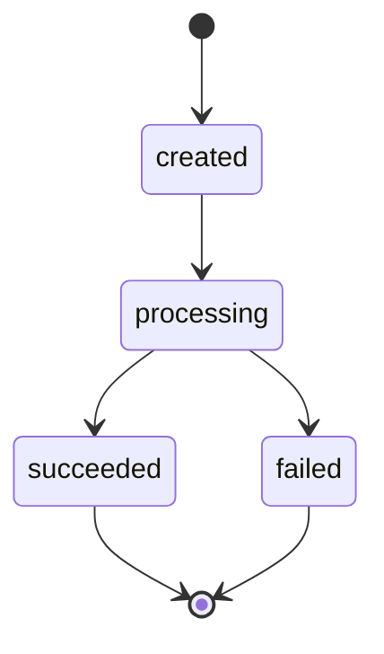

# Ledgerline

A payments backend, built in phases.

**Phase 0: Foundation** — repo, Docker, Alembic, CI scaffolding. Done.
**Phase 1: The money model** — a double-entry ledger. Done.
**Phase 2: Payment lifecycle** — a state machine, a fake processor, an atomic
charge flow. Done.
**Phase 3: Idempotency** — a retried charge happens once. Done.
**Phase 4: Concurrency** — two races, reproduced and fixed. You are here.

## Stack

- Python 3.13 — the local venv and the CI runner are pinned to the same version,
  in `.github/workflows/ci.yml` and ruff's `target-version` in `pyproject.toml`
- FastAPI + uvicorn
- Postgres 16 (Docker Compose)
- SQLAlchemy 2.0 async (asyncpg)
- Alembic (async-configured)
- pytest + pytest-asyncio + httpx
- ruff
- pydantic-settings (config from `.env`)

## Phase 1: the money model

Phase 1 is a ledger and nothing else. No charge flow, no processor, no
idempotency keys, no webhooks — those are later phases. What it does establish is
the set of rules everything afterwards has to obey.

### Money is an integer, everywhere

Amounts are `BIGINT` **minor units**: paise for INR, cents for USD. `2500.00 INR`
is the integer `250000`. There is no float and no `Decimal` at any layer — not in
the column type, not in Python, not on the wire.

The API boundary enforces this rather than assuming it. Request amounts are typed
`StrictInt`, so a JSON body containing `250000.0` or `"250000"` is rejected with a
422 instead of being quietly coerced to `250000`. A rounding bug you never write
is one you never have to find.

There is one subtlety worth naming: `SUM()` over a `bigint` column returns
`numeric` in Postgres, which asyncpg hands back as a Python `Decimal`. Every SUM
in [app/ledger.py](app/ledger.py) is therefore cast back with `::bigint`, so money
does not silently change type on the way out of the database.

### Balances are derived, never stored

`accounts` has **no balance column**. Look at the table; there is nowhere to put
one. A balance is always computed with a SQL SUM over `ledger_entries`:

```sql
SELECT COALESCE(
    SUM(CASE direction
            WHEN 'credit' THEN amount
            WHEN 'debit'  THEN -amount
        END),
    0
)::bigint
FROM ledger_entries
WHERE account_id = :account_id
```

**Balance convention, used everywhere without exception:**

```
balance = SUM(credit amounts) - SUM(debit amounts)
```

Crediting an account raises its balance; debiting it lowers it. Which convention
you pick matters far less than applying one consistently, so it is stated once in
[app/ledger.py](app/ledger.py), repeated here, and never re-decided inside a route.

A stored balance is a cached total that has to be kept in step with the entries
that justify it. The moment a crash, a retry, or a race lands between the two
writes, the balance and its own audit trail disagree — and the balance is the one
customers see. Deriving it means the number and its explanation cannot drift,
because they are the same thing.

### The ledger is append-only, and Postgres enforces it

Every posting is a `ledger_transaction` grouping two or more `ledger_entries`.
Entries carry a positive `amount` and a `direction` of `debit` or `credit`; the
sign lives in the direction, so `amount > 0` is a simple CHECK constraint and a
negative credit is not representable.

Nothing in the application ever issues an `UPDATE` or `DELETE` against those
tables — but "the application never does it" is a convention, and conventions get
broken by a data-fix script, a psql session, or a teammate in six months. So
migration [0002](alembic/versions/0002_ledger.py) installs triggers that make the
database refuse:

```sql
CREATE TRIGGER ledger_entries_immutable
BEFORE UPDATE OR DELETE ON ledger_entries
FOR EACH STATEMENT EXECUTE FUNCTION ledgerline_forbid_mutation();
```

Try it against a running database:

```powershell
docker compose exec postgres psql -U postgres -d ledgerline -c "UPDATE ledger_entries SET amount = 1;"
# ERROR: ledgerline: UPDATE on ledger_entries is not permitted -- the ledger is append-only
```

Two deliberate choices here:

- **`FOR EACH STATEMENT`, not `FOR EACH ROW`.** A row-level trigger only fires for
  rows the statement actually matched, so `DELETE FROM ledger_entries WHERE false`
  would report success and teach you the wrong lesson. A statement-level trigger
  rejects the operation unconditionally.
- **TRUNCATE is not blocked.** TRUNCATE does not fire UPDATE or DELETE triggers,
  and the test suite uses it to reset state between tests. It is the one sanctioned
  way to clear the ledger, and it exists for tests only.

Corrections, when they come in a later phase, are made the way real ledgers make
them: by posting a compensating entry, not by editing history.

### Every transaction must sum to zero

Within one `ledger_transaction`, total debits must equal total credits. This is
checked in [app/routers/transactions.py](app/routers/transactions.py) **inside the
database transaction, before commit**:

1. Write every entry.
2. `FLUSH`, then ask the database to total the debits and credits it now holds.
3. Commit only if they match; otherwise `ROLLBACK` and return 422.

Step 2 reads the totals back out of the database rather than re-adding the numbers
in the request body. The thing being verified is the state that would actually be
committed, not the intent that produced it — if serialization mangled something
between the two, this catches it.

Because the check runs before `COMMIT`, a rejected posting leaves nothing behind:
no orphaned transaction row, no half-written entry. Empty postings are rejected at
the schema, and single-sided postings fail the sum check with a distinct message.

**All entries in one transaction must also share a single currency**, resolved
from the `accounts` rows the entries point at — checked *before* the sum, because
summing 100 paise against 100 cents is meaningless arithmetic rather than a near
miss. A mixed-currency posting rolls back with a 422. This is the whole rule:
there is no FX, no conversion, and no currency column on transactions.

### Endpoints

| Method | Path                        | Behaviour                                                   |
| ------ | --------------------------- | ----------------------------------------------------------- |
| `POST` | `/accounts`                 | `{name, currency?}` → 201 with the created account           |
| `GET`  | `/accounts/{id}/balance`    | `{account_id, currency, balance}` derived by SQL SUM; 404 if unknown |
| `POST` | `/transactions`             | Posts a balanced entry set atomically; 422 if unbalanced     |

Balances are in minor units. `POST /transactions` also returns 422 for a posting
that mixes currencies, or for an entry referencing an account that does not exist.

### Not in Phase 1 (on purpose)

Idempotency keys (Phase 3), concurrency and row locking (Phase 4), the real charge
flow and processor adapter (Phase 2), webhooks and the outbox (Phase 5). There are
no overdraw guards yet — an account can go arbitrarily negative, which is correct
for a ledger that does not yet model credit limits.

`payments` existed as an empty placeholder table so the schema was complete. It had
no lifecycle, no status machine, and nothing read or wrote it — until Phase 2.

## Phase 2: the payment lifecycle

Phase 1 could move money correctly. It could not *attempt* anything: there was no
way to express "we asked a card processor for 2500 rupees and it said no." Phase 2
adds that, and with it the question the rest of the project is really about.

**Before:** a charge is a function that takes money and might throw halfway
through, leaving whatever it had already written behind it.

**After:** a charge is a state machine with one commit point. It either moves the
full amount and says `succeeded`, or it moves nothing and says `failed`. There is
no third outcome, and there is no partial one.

### The state machine



The complete set of legal moves, which is the table in
[app/payments.py](app/payments.py) and not a paraphrase of it:

| From         | May move to            | Why nowhere else                                       |
| ------------ | ---------------------- | ------------------------------------------------------ |
| `created`    | `processing`           | A payment cannot settle before a processor was asked   |
| `processing` | `succeeded`, `failed`  | The two things a processor can answer                  |
| `succeeded`  | — (terminal)           | Phase 6 adds `→ refunded`; until then, settled is settled |
| `failed`     | — (terminal)           | A retry is a **new payment**, not a resurrection       |
| `refunded`   | — (unreachable)        | Defined in the enum for Phase 6; nothing reaches it yet |

Every change goes through one function:

```python
transition(payment, PaymentStatus.SUCCEEDED)   # legal from processing
transition(payment, PaymentStatus.PROCESSING)  # from succeeded: raises
```

An illegal move raises `IllegalTransitionError` and **leaves the payment exactly
as it was**. The check runs before the assignment, so a caller that catches the
error still holds an unmodified row — "raises, but mutated anyway" is the worst of
both designs. This matters because `payment.status = "succeeded"` is one keystroke,
can be written from anywhere, and looks entirely reasonable in a diff. Making the
table the only route means an illegal transition is a loud failure rather than a
silent one.

`refunded` is in the Postgres enum but unreachable: no transition leads to it and
no endpoint produces one. It is there because widening an enum later is a migration
and a deploy-ordering problem, and this was the cheap moment to avoid both. A test
asserts it stays unreachable, so "we forgot to wire up refunds" cannot pass for
"refunds work."

### The fake processor

[app/processor.py](app/processor.py) has no network, no API key, and no SDK. It
returns the outcome it was told to return, after the delay it was told to wait:

```python
class ProcessorAdapter(Protocol):
    async def charge(self, amount: int, currency: str) -> ChargeResult: ...
```

That is not a shortcut around integrating a real processor — it is the instrument
this phase is built to use. The guarantee below is "a failed charge moves no
money," and you cannot test that if the only way to see a failure is to wait for a
real one. Failures have to be summonable on demand.

Two knobs, settable in two places:

| Setting                | Env / `.env`           | Per-request body    |
| ---------------------- | ---------------------- | ------------------- |
| Outcome                | `PROCESSOR_OUTCOME`    | `force_outcome`     |
| Injected latency       | `PROCESSOR_LATENCY_MS` | `force_latency_ms`  |

The per-request form is what lets the smoke script prove the failure path against
a running server without restarting it under different environment variables.
`ChargeResult` carries a `processor_ref` **even on failure**, because a declined
charge has a reference and it is the only handle anyone has when a customer asks
why their card was refused.

The latency knob is not decoration either. The charge flow calls the processor
with a database transaction already open, so every injected millisecond is a
millisecond a Postgres connection sits idle inside a write transaction, holding
its locks. Set `force_latency_ms` and the cost is visible. That is Phase 4's
problem statement, made reproducible in advance.

### The charge flow, and what commits

`POST /charges` takes `{account_id, amount, currency?}` and runs one database
transaction with exactly one commit on each path:

```
INSERT payment (created)
UPDATE payment -> processing
── call the processor ──────────────────  (no database work in flight)
success:  INSERT ledger_transaction + 2 entries, UPDATE payment -> succeeded
failure:  UPDATE payment -> failed
COMMIT
```

| Outcome                         | `payments` row        | ledger rows           |
| ------------------------------- | --------------------- | --------------------- |
| processor succeeded             | committed `succeeded` | committed, balanced   |
| processor declined              | committed `failed`    | **never written**     |
| ledger invariant violated (bug) | rolled back, no row   | rolled back           |
| illegal transition (bug)        | rolled back, no row   | rolled back           |

Row two is the headline, and *how* it is achieved is the point. The ledger is not
written and then deleted, and it is not corrected by a compensating posting. No
ledger row is written at all until the processor has already said yes. There is no
partial posting to clean up because a partial posting is never constructed. The
failure path commits one UPDATE to one row and touches nothing else.

Rows three and four are a deliberate asymmetry. If Ledgerline builds a posting that
does not balance, or requests a transition the machine forbids, that is a bug in
Ledgerline — and the whole transaction is abandoned, payment row included. A
payment record that cannot be justified by balanced postings is worse than no
record at all, because it is a number someone will eventually trust.

### A charge needs a counterparty

Double-entry has no way to write "from outside" — every leg needs an account. So a
charge posts two legs:

```
DEBIT   house:card_settlement:INR    250000
CREDIT  <the customer's account>     250000
```

The house account stands in for the outside world the money arrived from. It is
debited by exactly what customer accounts are credited, so its balance is the
negative of everything ever funded in that currency and the ledger as a whole still
sums to zero. There is one per currency (a posting may not mix currencies), it is
created on demand, and a partial `UNIQUE` index over the `house:` namespace makes
that get-or-create race-free without constraining customer account names.

### The guarantee, in the database

The charge route arranges all of the above correctly. But "the route is careful" is
the same class of promise as "the application never `UPDATE`s the ledger" — true
until someone writes a second route. So migration
[0003](alembic/versions/0003_payment_lifecycle.py) states it as a constraint:

```sql
ALTER TABLE payments ADD CONSTRAINT ck_payments_posting_matches_status
CHECK ((status = 'succeeded') = (ledger_transaction_id IS NOT NULL));
```

Exactly the succeeded payments have a posting. A payment marked `succeeded` with no
money behind it, or marked `failed` while pointing at one, cannot be stored — even
by a psql session that bypasses the application entirely:

```powershell
docker compose exec postgres psql -U postgres -d ledgerline -c "UPDATE payments SET status = 'succeeded' WHERE status = 'failed';"
# ERROR: new row for relation "payments" violates check constraint "ck_payments_posting_matches_status"
```

Note the asymmetry with Phase 1: the ledger tables reject `UPDATE` outright, but
`payments` is **mutable on purpose**. A payment's status legitimately changes —
that is what a lifecycle is. Only the money is append-only.

### 201 on a decline

`POST /charges` returns **201 for both outcomes**, including a declined charge, with
the result in `status`. The payment resource was created either way, and a decline
is a business result rather than a failed request: the caller asked Ledgerline to
attempt a charge, it did, and it recorded the answer. A 4xx would conflate "your
request was wrong" with "the card said no." A 4xx here means the *request* was bad —
unknown account (404), currency mismatch or non-integer amount (422).

### The gap this leaves, stated plainly

If the process dies between the processor returning success and `COMMIT`, the card
was charged and Ledgerline has no record of it — the payment row was never
committed, so nothing even knows to go looking. The naive flow cannot close that
window: a single database transaction cannot span a third party's system. That is
what Phase 5 (outbox + reconciliation) is for, and naming it here is why it is on
the roadmap rather than a surprise later.

### Not in Phase 2 (on purpose)

No locking, no advisory locks, no version column (Phase 4). No webhooks and no
outbox (Phase 5). No refund endpoint or logic; `refunded` is an enum value and
nothing more (Phase 6). Idempotency arrived in Phase 3, below — as Phase 2 shipped,
sending the same charge twice produced two payments and two postings.

### Endpoints added

| Method | Path            | Behaviour                                                        |
| ------ | --------------- | ---------------------------------------------------------------- |
| `POST` | `/charges`      | `{account_id, amount, currency?}` → 201 with the payment, `status` = `succeeded` or `failed` |
| `GET`  | `/charges/{id}` | The payment as stored; 404 if unknown                            |

## Phase 3: idempotency

Phase 2's charge flow was correct and still dangerous. It had no way to tell a
genuine second purchase from the same purchase arriving twice — and the same
purchase arrives twice constantly: a double-clicked button, a mobile client
retrying a POST whose response was lost to a dead cell, a load balancer replaying a
request it decided had timed out.

**Before:** the customer clicks Pay twice and is charged twice. Both charges are
individually perfect — balanced postings, correct states, a clean audit trail
saying exactly how they were robbed.

**After:** the second request returns the first request's response, byte for byte.
One payment, one posting, one authorisation on the card.

Only the caller knows whether two requests mean one purchase, so only the caller
can say. That is what the `Idempotency-Key` header is for.

### The contract

`POST /charges` **requires** an `Idempotency-Key` header.

| Situation                          | Response                                          |
| ---------------------------------- | ------------------------------------------------- |
| New key                            | The charge runs; 201                              |
| Same key, same body                | The stored response, replayed byte for byte       |
| Same key, different body           | 422, and nothing is written                       |
| No key / blank / over 255 chars    | 400                                               |
| Key older than 24h                 | Treated as never used; the charge runs            |

Required rather than optional. An optional safety net is missing from exactly the
client that needed it, and a caller who has not thought about retries is the one
most likely to send one.

### The claim is a database decision

Ownership of a key is settled by Postgres, not by application logic:

```sql
INSERT INTO idempotency_keys (key, request_hash, status, expires_at)
VALUES (:key, :request_hash, 'in_progress', now() + (:ttl_seconds * interval '1 second'))
ON CONFLICT (key) DO UPDATE
SET request_hash = EXCLUDED.request_hash, status = 'in_progress',
    response_snapshot = NULL, response_status = NULL,
    created_at = now(), expires_at = EXCLUDED.expires_at
WHERE idempotency_keys.expires_at <= now()
RETURNING key
```

A row comes back exactly when this request now owns the key — either it was free,
or it held an expired claim just reset in place. No row means a live claim exists
and this is a retry. The `DO UPDATE ... WHERE expired` branch is what makes TTL
expiry work without a sweeper: an expired key is *reclaimed*, and reset completely,
because a key past its TTL must behave exactly like one that was never used.

Writing this as `SELECT` then `INSERT` would be the same shape of mistake this
project is about — a gap between deciding and acting, wide enough for a second
request to charge the card again.

### The key commits with the charge

The claim runs **inside the charge's transaction**. That one decision answers what
happens when a request dies partway through: if the charge does not commit, neither
does the claim, so the key was never consumed and the retry is free to try again.
There is no cleanup path and no reaper, because a key that did not commit does not
exist. A charge that 404s on an unknown account leaves no key behind — there is a
test for exactly that.

The visible cost: `status = 'in_progress'` is **never observed in committed data**
in Phase 3. A key becomes visible to anyone else only once it is already
`completed`. The column exists because Phase 4 needs it.

### What the fingerprint covers, and what it deliberately does not

`request_hash` is SHA-256 over a canonical JSON encoding of **`account_id`,
`amount`, `currency`** — who is being charged, how much, in what units.

It **excludes `force_outcome` and `force_latency_ms`**, the fake processor's test
knobs. Those change how a charge is *simulated*, not which charge it is. Including
them would mean a retry that flipped `force_outcome` counted as a different request
and charged again — reintroducing the exact double-charge this feature prevents,
via a field that will not exist once a real adapter lands. Excluding them also
gives the honest semantics: **a key pins an outcome.** Replay a key that recorded a
decline and you get that decline back, no matter what the retry asks for.

`currency` is hashed as the client sent it, `null` included. Omitting it and
stating the account's own currency therefore produce different fingerprints even
though they resolve to the same charge. That is the conservative direction to be
wrong in: a false "different payload" is a 422 the client can see and fix, where a
false match would silently replay the wrong charge.

### Byte-identical, and why that took work

`response_snapshot` is `JSONB`, and JSONB normalises key order on write. So a
snapshot that round-trips through Postgres serialises differently from the Python
dict that produced it — which would make the *first* response and its replays
differ, in exactly the way nobody notices until a client diffs them.

So the first response is not sent from the dict that was stored. It is read back
out of the database after the write and served from that. Both the original and
every replay are generated from identical bytes. The visible symptom of this
working is that charge responses come back in JSONB's key order rather than the
declaration order of `ChargeOut` — JSON objects are unordered, so no client should
care, but it is the fingerprint of the mechanism.

### The gap this leaves, stated plainly

Phase 3 handles a retry that arrives **after** the first request finished. Two
requests genuinely **in flight at once** on the same key are a different problem:
the first claim is invisible to everyone until it commits, and it does not commit
until the charge is done. Phase 4 owns that, and it is why `'in_progress'` exists
here but is never seen.

### Not in Phase 3 (on purpose)

No background expiry sweeper — expired keys are reclaimed lazily when the same key
is presented again, though `ix_idempotency_keys_expires_at` is there for when one
is written. No idempotency on any endpoint other than `POST /charges`. Simultaneous
same-key requests are Phase 4, below.

## Phase 4: concurrency

Every guarantee in Phases 1–3 was established against one request at a time. This
phase is what happens when two arrive together.

Both bugs below are **still in the tree**, runnable, behind a setting. A
before/after where the "before" is a paragraph of prose is a claim; one where the
"before" is code you can execute is a measurement. Every number in this section was
produced by [tests/test_concurrency.py](tests/test_concurrency.py) against a real
Postgres, and two tests exist purely to assert the broken paths are *still broken*
— because a reproduction that quietly stops reproducing is the one thing worse than
no reproduction.

```powershell
# See either bug for yourself
$env:IDEMPOTENCY_CLAIM_STRATEGY="naive" ; $env:NAIVE_RACE_WINDOW_MS="300"
$env:WITHDRAWAL_GUARD="naive"
```

### Race 1 — one idempotency key, fifty simultaneous requests

Phase 3 made a *retry* safe. It said nothing about two requests in flight at once,
because the winner's claim row is invisible to everyone until it commits.

**The broken claim** ([app/idempotency.py](app/idempotency.py)) is the version most
people write:

1. `SELECT` the key. Absent? Then this is a new charge.
2. …charge the card…
3. `INSERT` the key, `ON CONFLICT (key) DO NOTHING`.

Step 1's answer is a fact about the past by the time step 3 acts on it. Step 3 is
where it turns silent: without `ON CONFLICT`, the second insert would raise a
duplicate-key error and roll its charge back — the primary key would have saved you
*by accident*. `ON CONFLICT DO NOTHING` is the reasonable-looking line that removes
the accident. It was added to stop duplicate-key errors filling the logs. It works.
The logs go quiet. The system now writes two payments against one idempotency key.

**50 concurrent requests, one key, `amount = 250000`:**

| | payments | postings | ledger entries | keys | balance | statuses |
|---|---|---|---|---|---|---|
| **Before** | **50** | 50 | 100 | 1 | **12,500,000** | `201 × 50` |
| **After** | **1** | 1 | 2 | 1 | **250,000** | `201 × 1`, `409 × 49` |

The customer asked to be charged ₹2,500 and was charged ₹1,25,000. One idempotency
key was faithfully written, and prevented nothing.

**The fix** is a non-blocking advisory lock taken *before* the claim:

```sql
SELECT pg_try_advisory_xact_lock(:lock_id)
```

Worth being precise about what this fixes, because it is not correctness. The
Phase 3 `ON CONFLICT` claim was **already correct** under concurrency: Postgres
makes the loser wait on the winner's uncommitted row, and once it commits the loser
sees `completed` and replays. Measured before this phase, 20 concurrent requests
produced exactly 1 payment and 20 × `201`.

What it cost was *liveness*. Every loser sat blocked for the length of a card
authorisation, holding a connection. Fifty retries of one charge become fifty
Postgres backends asleep behind one slow payment processor — and connection
exhaustion arrives long before the correctness ever fails.

`pg_try_advisory_xact_lock` answers immediately instead:

| 8 requests, 1200 ms processor call | latency |
|---|---|
| winner (`201`) | 1237 ms |
| losers (`409`) | median **12.2 ms**, max 15.1 ms |

A duplicate in-flight request now costs a 409 and twelve milliseconds instead of a
connection and a second and a quarter. The client retries and gets the recorded
response.

**Why `409` rather than blocking until the winner finishes and replaying?** Both
are defensible, and Stripe returns 409 here too. Blocking gives the client a nicer
answer — the real response instead of "try again" — at the cost of pinning a
connection for an unbounded time that is controlled by a third party. Refusing
fast keeps the failure in the client's retry loop, where it is cheap and visible,
rather than in the connection pool, where it is expensive and looks like something
else entirely at 3am.

**Why transaction-scoped (`_xact_`)?** It is released by `COMMIT`, by `ROLLBACK`,
and by the backend dying. There is no path, including a hard crash mid-charge, that
leaks one. A session-scoped `pg_advisory_lock` needs an explicit unlock, and every
explicit unlock is a line some error path fails to reach.

**Why hash the key in Python rather than with `hashtext()`?** `hashtext` is an
internal Postgres function with no compatibility promise, and its output has changed
across major versions. A lock id that silently changes during an upgrade is a lock
that stops locking.

### Race 2 — one account, two withdrawals

Phase 4 adds `POST /withdrawals`, the mirror of a charge: it DEBITs the customer and
CREDITs the house account. It is the first operation in Ledgerline that has to
*refuse*, and refusing means checking, and checking is where this bug lives.

```
request A          request B
---------          ---------
reads 1000
                   reads 1000
1000-600 >= 0 OK
                   1000-600 >= 0 OK
writes -600
                   writes -600
COMMIT             COMMIT        -> balance is now -200
```

Neither request did anything wrong. Both read a true balance and applied a correct
rule to it. The balance simply was not true any more by the time either one acted.

**20 concurrent withdrawals of 10,000 against a balance of 100,000** (only 10 are
affordable):

| | honoured | rejected | final balance |
|---|---|---|---|
| **Before** | **20 of 20** | 0 | **−100,000** |
| **After** | 10 of 20 | 10 × `422` | **0** |

The account was overdrawn by exactly the amount it held. Note what is *not* broken:
every posting still balances, the ledger still sums to zero, every invariant from
Phase 1 holds perfectly. The bookkeeping is immaculate. Only the *rule* was broken —
which is precisely why this class of bug survives code review and audit alike.

**The fix** is one statement, in the right place:

```sql
SELECT id FROM accounts WHERE id = :account_id FOR UPDATE
```

taken **before** the balance is read. The order is the whole thing: a lock taken
after the read protects nothing, because the value it is meant to protect has
already been copied into a Python variable. From there to `COMMIT`, no other
withdrawal against that account can read its balance — they queue on this
statement, and each one in turn reads a balance that already includes every
withdrawal ahead of it.

Only the `id` is selected. The row is being used as a mutex, and reading columns
from it would imply the balance lives there. It does not, and never has.

#### Why a constraint cannot do this

The instinct is `CHECK (balance >= 0)`, and it cannot be written. A CHECK sees only
the row being written, and the balance is a `SUM` over *other* rows. A trigger can
compute that sum — and under `READ COMMITTED` both transactions see the same
pre-race snapshot, reach the same wrong answer, and both allow it. The check is not
in the wrong place. The problem is that the check and the write are two moments, and
something has to make them one.

#### Row lock vs `SERIALIZABLE` + retry

| | `SELECT … FOR UPDATE` (chosen) | `SERIALIZABLE` + retry |
|---|---|---|
| Style | Pessimistic — take the lock, then look | Optimistic — act, and be told you conflicted |
| Contention | Per account. Different accounts never contend | Whole-transaction; unrelated work can abort |
| Failure mode | Blocking, and deadlock if lock order is inconsistent | `40001` serialization failure, needs a retry loop |
| The catch | You must *remember* to take it — it is a convention, not an invariant | The database notices for you |

Chosen `FOR UPDATE` because the contention is naturally per-account and the lock
scope matches the problem exactly: two withdrawals on one account genuinely must
serialise, and withdrawals on different accounts genuinely need not. It also fails
predictably. `SERIALIZABLE` is the better answer when the conflict shape is not
known in advance; here it is known precisely.

The honest cost is in that last row. Nothing in the database forces a future
`POST /transfers` to take the lock, and if it forgets, the guard is silently gone
for that path. `FOR UPDATE` buys correctness with a rule people must keep, which is
strictly weaker than the DB-enforced invariants in Phases 1–3.

### Making the concurrency real

A sequential loop dressed as a concurrency test proves nothing, so the chain is
worth stating:

1. `asyncio.gather` schedules all N coroutines before any completes.
2. FastAPI's `get_session` builds a **separate `AsyncSession`** per request.
3. Each session takes a **separate asyncpg connection** — the pool is sized 25 + 35
   overflow in [app/db.py](app/db.py) precisely so 50 requests do not queue on the
   client and quietly serialise.
4. Each connection is a **separate Postgres backend in a separate transaction**.

`test_the_requests_actually_overlap` asserts this instead of assuming it: 12
requests each holding a 300 ms processor call must finish in well under 3.6 s.

Determinism comes from `NAIVE_RACE_WINDOW_MS`, which widens the check-then-act
window on the naive paths only. It does not create either bug — both windows exist
at zero, since a `SELECT` and a later `INSERT` are two statements with a round trip
between them — it makes them reproduce on every run rather than on unlucky ones.

**One measurement trap worth recording.** The first version of the liveness test
fired all 50 requests and timed each one. The losers appeared to take ~740 ms
against a 300 ms processor call, which looks exactly like lock blocking and is not:
with 50 coroutines on one event loop, a request's wall time includes every slice the
loop spent on the other 49. The test now runs at 8-way concurrency, where the signal
is the lock rather than the scheduler.

### Endpoints added

| Method | Path            | Behaviour                                                        |
| ------ | --------------- | ---------------------------------------------------------------- |
| `POST` | `/withdrawals`  | `{account_id, amount, currency?}` → 201; 422 if it would breach the floor |

### Not in Phase 4 (on purpose)

Withdrawals take no `Idempotency-Key` — a retried withdrawal withdraws twice. Making
them idempotent is a mechanical repeat of Phase 3 against a second endpoint, and
this phase is about the races. The balance floor is global (`BALANCE_FLOOR_MINOR_UNITS`,
default 0), not per-account: no credit limits, no overdraft tiers. No webhooks or
outbox (Phase 5), no refunds (Phase 6).

## Running locally (Windows / PowerShell)

```powershell
# 1. Start Postgres
docker compose up -d

# 2. Create + activate a venv, install deps
python -m venv .venv
.\.venv\Scripts\Activate.ps1
pip install -r requirements.txt

# 3. Run migrations
alembic upgrade head

# 4. Run the app
uvicorn app.main:app --reload

# 5. Smoke checks (separate terminal)
.\scripts\smoke.ps1
.\scripts\smoke_phase2.ps1
.\scripts\smoke_phase3.ps1
.\scripts\smoke_phase4.ps1
```

`scripts\smoke.ps1` (Phase 1) creates two accounts, posts a balanced transfer,
asserts both derived balances, fires an unbalanced posting expecting a 422, and
confirms the rejected posting changed nothing.

`scripts\smoke_phase2.ps1` charges an account and asserts 201 + `succeeded` + the
balance moved, then forces a processor failure and asserts the payment is `failed`,
its `ledger_transaction_id` is null, and **the balance is unchanged** — the ledger
was never touched. It drives the failure with `force_outcome` in the request body,
so the server does not need restarting between the two checks.

`scripts\smoke_phase3.ps1` charges with an `Idempotency-Key`, sends the identical
request again with the same key, and asserts the response is byte-identical and the
balance moved **once**. Then it reuses the key with a different amount (422), omits
the header entirely (400), proves a fresh key is a fresh charge, and replays a
declined charge to show the failure path is idempotent too.

To force failures server-wide instead, restart under the environment variable:

```powershell
$env:PROCESSOR_OUTCOME = "failure"; uvicorn app.main:app --reload
# every charge now declines, and every one of them moves exactly zero money
```

## Tests

```powershell
docker compose up -d
alembic upgrade head
pytest
```

Tests run against a **real Postgres**, not SQLite and not a mock. The behaviour
under test — CHECK constraints, the append-only triggers, transactional rollback,
`SUM` semantics — is behaviour the database provides, and a stand-in would test
none of it. CI runs a `postgres:16` service for the same reason.

The exception is [tests/test_payment_state.py](tests/test_payment_state.py), the
only file in the suite that needs no database. That is deliberate: whether a state
change is legal is decided by the transition table and by nothing else, so testing
it should not require standing up a charge to reach each state.

## Phase 1 smoke acceptance criteria

- Balanced transfer moves both derived balances correctly (no stored balance)
- Unbalanced posting → 422 and zero rows written
- `UPDATE`/`DELETE` on `ledger_entries` → raises at the database
- `pytest` green locally and in CI

## Phase 2 smoke acceptance criteria

- Success: charge succeeds, state = `succeeded`, balances move, entries balanced
- Failure: forced processor failure → state = `failed`, **zero ledger entries**,
  balance unchanged
- Illegal state transitions raise
- `pytest` + `ruff` green locally and in CI

## Phase 3 smoke acceptance criteria

- Same key + same body → one charge, identical replayed response
- Same key + different body → 4xx, nothing written
- Missing key → 400. Expired key → fresh charge allowed
- Failure path replays identically
- `pytest` + `ruff` green locally and in CI

## Phase 4 smoke acceptance criteria

- 50 concurrent same-key charges → exactly one payment, one posting
- Concurrent withdrawals → balance never goes below the floor
- Broken reproductions preserved, runnable, and asserted to still reproduce
- Real concurrency (separate sessions, connections and backends), not a loop
- `pytest` + `ruff` green locally and in CI

## Notes

- `/health` is dependency-free (no DB call) so it works without Postgres running.
- `.env` is gitignored; copy `.env.example` to `.env` to configure locally.
- Compose publishes Postgres on **5433** locally; CI uses **5432**. The difference
  lives in `DATABASE_URL` and nowhere else.
