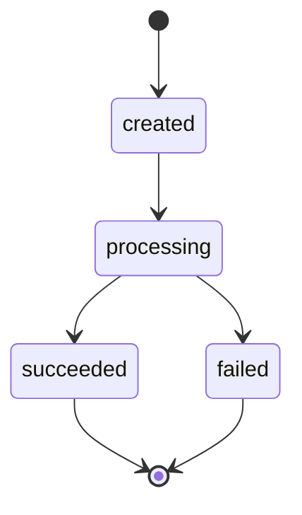

# Phase 2: the payment lifecycle

Phase 1 could move money correctly. It could not *attempt* anything: there was no
way to express "we asked a card processor for 2500 rupees and it said no." Phase 2
adds that, and with it the question the rest of the project is really about.

**Before:** a charge is a function that takes money and might throw halfway
through, leaving whatever it had already written behind it.

**After:** a charge is a state machine with one commit point. It either moves the
full amount and says `succeeded`, or it moves nothing and says `failed`. There is
no third outcome, and there is no partial one.

### The state machine



The complete set of legal moves, which is the table in
[app/payments.py](../app/payments.py) and not a paraphrase of it:

| From         | May move to            | Why nowhere else                                       |
| ------------ | ---------------------- | ------------------------------------------------------ |
| `created`    | `processing`           | A payment cannot settle before a processor was asked   |
| `processing` | `succeeded`, `failed`  | The two things a processor can answer                  |
| `succeeded`  | — (terminal)           | Phase 6 adds `→ refunded`; until then, settled is settled |
| `failed`     | — (terminal)           | A retry is a **new payment**, not a resurrection       |
| `refunded`   | — (unreachable)        | Defined in the enum for Phase 6; nothing reaches it yet |

Every change goes through one function:

```python
transition(payment, PaymentStatus.SUCCEEDED)   # legal from processing
transition(payment, PaymentStatus.PROCESSING)  # from succeeded: raises
```

An illegal move raises `IllegalTransitionError` and **leaves the payment exactly
as it was**. The check runs before the assignment, so a caller that catches the
error still holds an unmodified row — "raises, but mutated anyway" is the worst of
both designs. This matters because `payment.status = "succeeded"` is one keystroke,
can be written from anywhere, and looks entirely reasonable in a diff. Making the
table the only route means an illegal transition is a loud failure rather than a
silent one.

`refunded` is in the Postgres enum but unreachable: no transition leads to it and
no endpoint produces one. It is there because widening an enum later is a migration
and a deploy-ordering problem, and this was the cheap moment to avoid both. A test
asserts it stays unreachable, so "we forgot to wire up refunds" cannot pass for
"refunds work."

### The fake processor

[app/processor.py](../app/processor.py) has no network, no API key, and no SDK. It
returns the outcome it was told to return, after the delay it was told to wait:

```python
class ProcessorAdapter(Protocol):
    async def charge(self, amount: int, currency: str) -> ChargeResult: ...
```

That is not a shortcut around integrating a real processor — it is the instrument
this phase is built to use. The guarantee below is "a failed charge moves no
money," and you cannot test that if the only way to see a failure is to wait for a
real one. Failures have to be summonable on demand.

Two knobs, settable in two places:

| Setting                | Env / `.env`           | Per-request body    |
| ---------------------- | ---------------------- | ------------------- |
| Outcome                | `PROCESSOR_OUTCOME`    | `force_outcome`     |
| Injected latency       | `PROCESSOR_LATENCY_MS` | `force_latency_ms`  |

The per-request form is what lets the smoke script prove the failure path against
a running server without restarting it under different environment variables.
`ChargeResult` carries a `processor_ref` **even on failure**, because a declined
charge has a reference and it is the only handle anyone has when a customer asks
why their card was refused.

The latency knob is not decoration either. The charge flow calls the processor
with a database transaction already open, so every injected millisecond is a
millisecond a Postgres connection sits idle inside a write transaction, holding
its locks. Set `force_latency_ms` and the cost is visible. That is Phase 4's
problem statement, made reproducible in advance.

### The charge flow, and what commits

`POST /charges` takes `{account_id, amount, currency?}` and runs one database
transaction with exactly one commit on each path:

```
INSERT payment (created)
UPDATE payment -> processing
── call the processor ──────────────────  (no database work in flight)
success:  INSERT ledger_transaction + 2 entries, UPDATE payment -> succeeded
failure:  UPDATE payment -> failed
COMMIT
```

| Outcome                         | `payments` row        | ledger rows           |
| ------------------------------- | --------------------- | --------------------- |
| processor succeeded             | committed `succeeded` | committed, balanced   |
| processor declined              | committed `failed`    | **never written**     |
| ledger invariant violated (bug) | rolled back, no row   | rolled back           |
| illegal transition (bug)        | rolled back, no row   | rolled back           |

Row two is the headline, and *how* it is achieved is the point. The ledger is not
written and then deleted, and it is not corrected by a compensating posting. No
ledger row is written at all until the processor has already said yes. There is no
partial posting to clean up because a partial posting is never constructed. The
failure path commits one UPDATE to one row and touches nothing else.

Rows three and four are a deliberate asymmetry. If Ledgerline builds a posting that
does not balance, or requests a transition the machine forbids, that is a bug in
Ledgerline — and the whole transaction is abandoned, payment row included. A
payment record that cannot be justified by balanced postings is worse than no
record at all, because it is a number someone will eventually trust.

### A charge needs a counterparty

Double-entry has no way to write "from outside" — every leg needs an account. So a
charge posts two legs:

```
DEBIT   house:card_settlement:INR    250000
CREDIT  <the customer's account>     250000
```

The house account stands in for the outside world the money arrived from. It is
debited by exactly what customer accounts are credited, so its balance is the
negative of everything ever funded in that currency and the ledger as a whole still
sums to zero. There is one per currency (a posting may not mix currencies), it is
created on demand, and a partial `UNIQUE` index over the `house:` namespace makes
that get-or-create race-free without constraining customer account names.

### The guarantee, in the database

The charge route arranges all of the above correctly. But "the route is careful" is
the same class of promise as "the application never `UPDATE`s the ledger" — true
until someone writes a second route. So migration
[0003](../alembic/versions/0003_payment_lifecycle.py) states it as a constraint:

```sql
ALTER TABLE payments ADD CONSTRAINT ck_payments_posting_matches_status
CHECK ((status = 'succeeded') = (ledger_transaction_id IS NOT NULL));
```

Exactly the succeeded payments have a posting. A payment marked `succeeded` with no
money behind it, or marked `failed` while pointing at one, cannot be stored — even
by a psql session that bypasses the application entirely:

```powershell
docker compose exec postgres psql -U postgres -d ledgerline -c "UPDATE payments SET status = 'succeeded' WHERE status = 'failed';"
# ERROR: new row for relation "payments" violates check constraint "ck_payments_posting_matches_status"
```

Note the asymmetry with Phase 1: the ledger tables reject `UPDATE` outright, but
`payments` is **mutable on purpose**. A payment's status legitimately changes —
that is what a lifecycle is. Only the money is append-only.

### 201 on a decline

`POST /charges` returns **201 for both outcomes**, including a declined charge, with
the result in `status`. The payment resource was created either way, and a decline
is a business result rather than a failed request: the caller asked Ledgerline to
attempt a charge, it did, and it recorded the answer. A 4xx would conflate "your
request was wrong" with "the card said no." A 4xx here means the *request* was bad —
unknown account (404), currency mismatch or non-integer amount (422).

### The gap this leaves, stated plainly

If the process dies between the processor returning success and `COMMIT`, the card
was charged and Ledgerline has no record of it — the payment row was never
committed, so nothing even knows to go looking. The naive flow cannot close that
window: a single database transaction cannot span a third party's system. That is
what Phase 5 (outbox + reconciliation) is for, and naming it here is why it is on
the roadmap rather than a surprise later.

### Not in Phase 2 (on purpose)

No locking, no advisory locks, no version column (Phase 4). No webhooks and no
outbox (Phase 5). No refund endpoint or logic; `refunded` is an enum value and
nothing more (Phase 6). Idempotency arrived in [Phase 3](phase-3-idempotency.md) — as Phase 2 shipped,
sending the same charge twice produced two payments and two postings.

### Endpoints added

| Method | Path            | Behaviour                                                        |
| ------ | --------------- | ---------------------------------------------------------------- |
| `POST` | `/charges`      | `{account_id, amount, currency?}` → 201 with the payment, `status` = `succeeded` or `failed` |
| `GET`  | `/charges/{id}` | The payment as stored; 404 if unknown                            |

## Smoke acceptance criteria

- Success: charge succeeds, state = `succeeded`, balances move, entries balanced
- Failure: forced processor failure → state = `failed`, **zero ledger entries**,
  balance unchanged
- Illegal state transitions raise
- `pytest` + `ruff` green locally and in CI


---

**← Previous:** [Phase 1: the money model](phase-1-ledger.md) · **[All phases](../README.md#the-phases)** · **Next:** [Phase 3: idempotency](phase-3-idempotency.md) →
